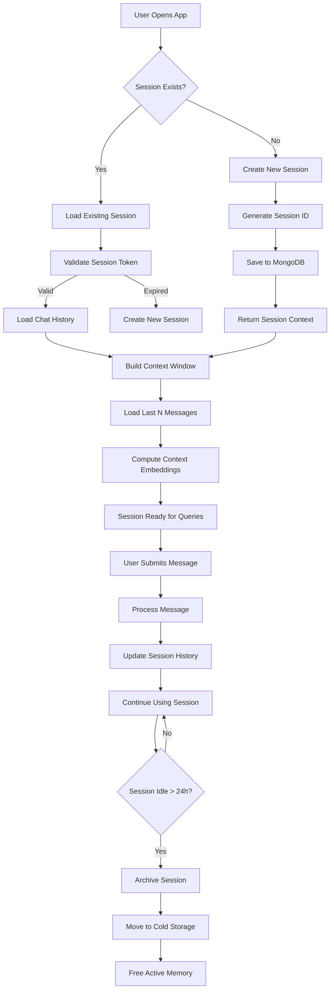
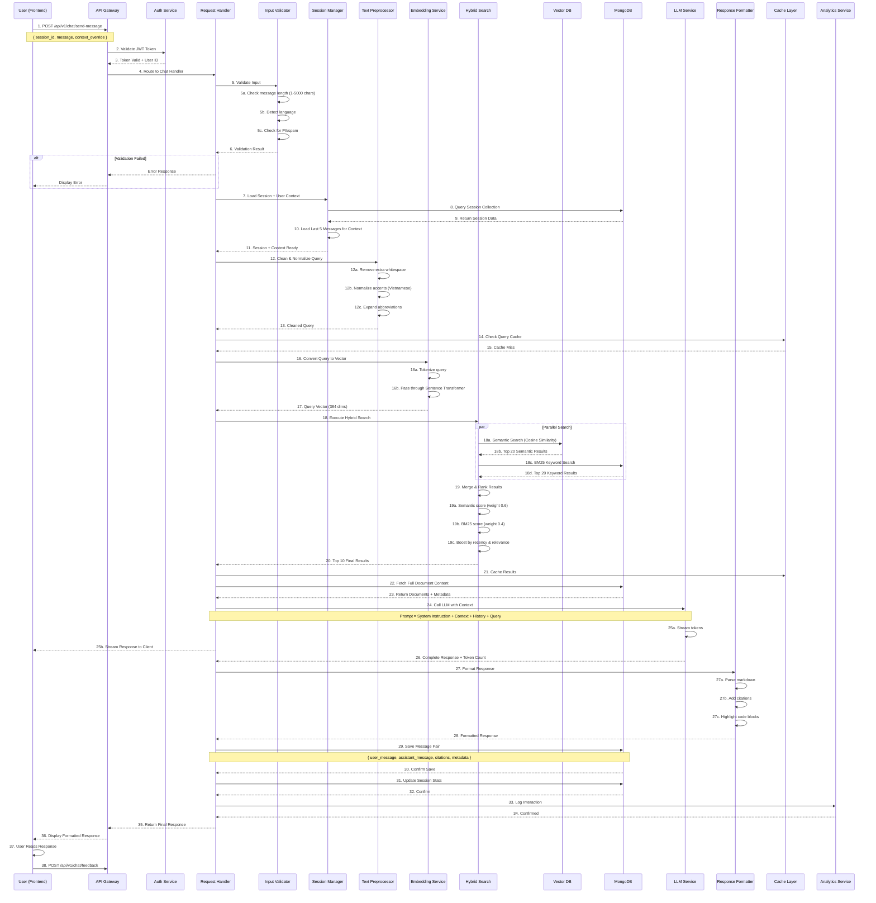
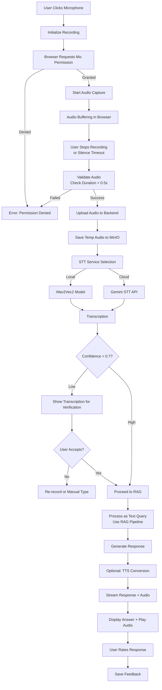
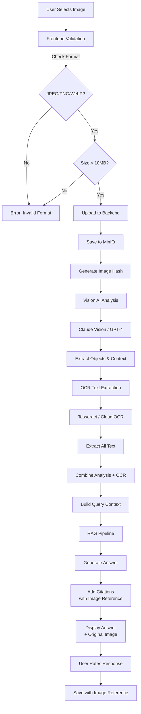
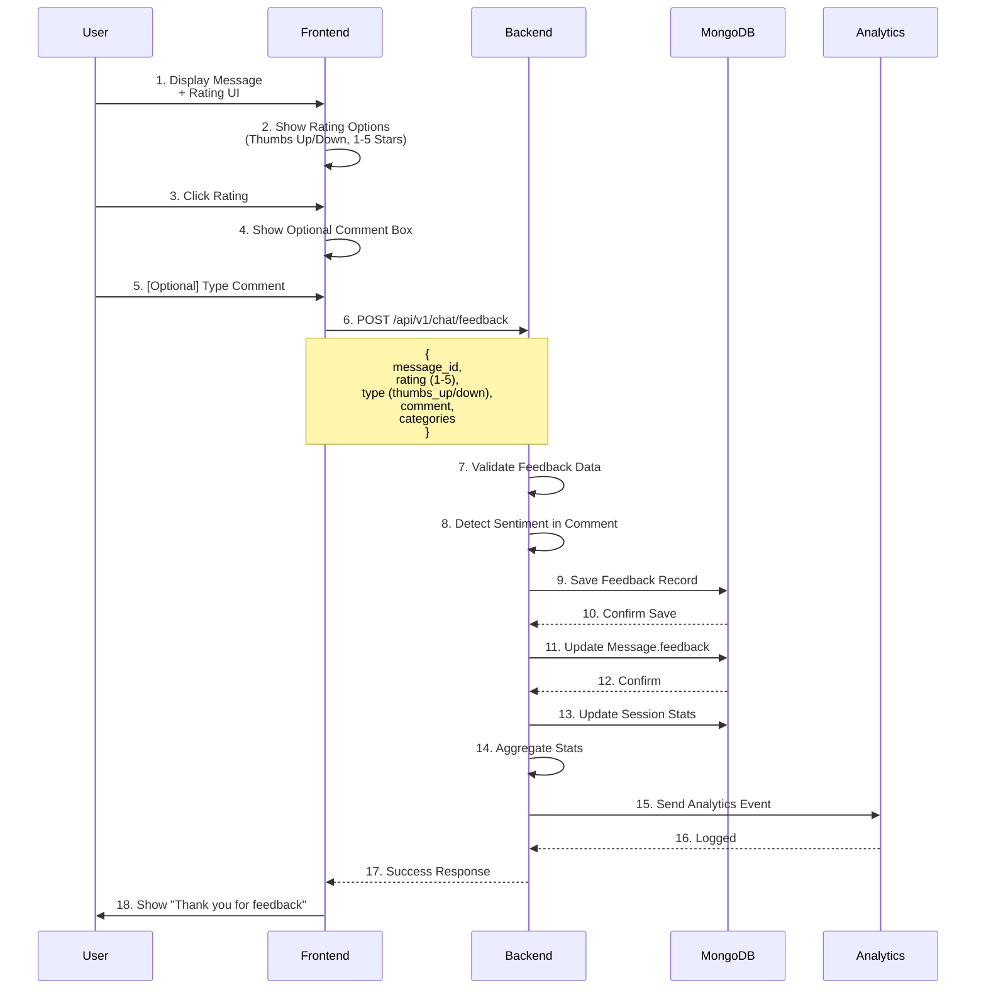

# COMPREHENSIVE CHAT WORKFLOW DOCUMENTATION

## Table of Contents
1. Architecture Overview
2. Session Management Workflow
3. Text Query Processing (Core RAG)
4. Voice Query Processing
5. Image Query Processing
6. Message History & Context Management
7. Feedback System
8. User Profile & Personalization
9. Error Handling & Recovery
10. Performance Optimization

---

## 1. Architecture Overview

### System Components
```
Frontend (React) ──┐
                   ├─→ FastAPI Backend ──→ API Key Gate (AMI_API_KEY)
                   │                   └─→ Auth Service
Voice Input ──────┤                   ├─→ Chat Service (Orchestrator)
Image Input ──────┤                   ├─→ Embedding Service
                   └─→ WebSocket ──┐  ├─→ LLM Service
                                   └→ MongoDB (Persistence)
                                     ├─→ Qdrant (Vector Store)
                                     └─→ MinIO (File Storage)
```

### Data Flow Layers
```
Layer 0: Client API Key Validation (X-AMI-API-Key)
         ↓
Layer 1: User Input (Text/Voice/Image)
         ↓
Layer 2: Input Validation & Normalization
         ↓
Layer 3: Session Management & Context Loading
         ↓
Layer 4: Semantic Processing (Embedding/STT/OCR)
         ↓
Layer 5: Information Retrieval (Hybrid Search)
         ↓
Layer 6: Response Generation (LLM)
         ↓
Layer 7: Response Formatting & Delivery
         ↓
Layer 8: Feedback & Analytics
```

### API Access Requirements

- Every request to `/api/v1/*` must include `X-AMI-API-Key`.
- Backend validates the key against `AMI_API_KEY` in `.env`.
- Missing or invalid key returns `401 Unauthorized`.
- If `AMI_API_KEY` is not configured, return `503 Service Unavailable` (kill switch).

---

## 2. Session Management Workflow

### 2.1 Session Lifecycle (Complete Flow)



### 2.2 Session Data Model

```json
{
  "_id": ObjectId("507f1f77bcf86cd799439011"),
  "session_id": "sess_a1b2c3d4e5f6g7h8",
  "user_id": "user_12345",
  "status": "active",           // active, archived, deleted
  "created_at": ISODate("2025-12-26T10:00:00Z"),
  "last_activity": ISODate("2025-12-26T11:30:00Z"),
  "expires_at": ISODate("2025-12-27T10:00:00Z"),
  
  // Conversation metadata
  "title": "Questions about Admission",
  "total_messages": 15,
  "user_messages": 8,
  "assistant_messages": 7,
  
  // Context window
  "context": {
    "major": "IT",
    "year": 1,
    "language": "vi",
    "model": "gpt-4",
    "temperature": 0.7,
    "max_tokens": 2000
  },
  
  // Messages (stored separately due to size)
  "message_ids": [
    "msg_001", "msg_002", "msg_003", ...
  ],
  
  // Session tags & metadata
  "tags": ["admission", "curriculum"],
  "is_bookmarked": false,
  "summary": "Student asking about IT curriculum requirements",
  "ai_generated_title": true,
  
  // Statistics
  "stats": {
    "total_tokens_used": 5432,
    "avg_response_time_ms": 2340,
    "avg_response_rating": 4.2,
    "feedback_count": 3
  }
}
```

### 2.3 Session Endpoints

```
POST   /api/v1/chat/sessions              # Create new session
GET    /api/v1/chat/sessions              # List user's sessions
GET    /api/v1/chat/sessions/{id}         # Get session details
PUT    /api/v1/chat/sessions/{id}         # Update session (title, tags)
DELETE /api/v1/chat/sessions/{id}         # Delete session
GET    /api/v1/chat/sessions/{id}/export  # Export conversation
POST   /api/v1/chat/sessions/{id}/archive # Archive session
```

---

## 3. Text Query Processing (Core RAG)

### 3.1 Complete Query Processing Flow



### 3.2 Message Data Model

```json
{
  "_id": ObjectId("507f1f77bcf86cd799439012"),
  "message_id": "msg_001",
  "session_id": "sess_a1b2c3d4e5f6g7h8",
  "user_id": "user_12345",
  
  // Message pair
  "user_message": {
    "content": "What are the admission requirements for IT?",
    "timestamp": ISODate("2025-12-26T10:05:00Z"),
    "language": "en",
    "length": 45,
    "embedding": [0.123, -0.456, ...],  // 384 dims
    "cleaned_content": "what admission requirements IT"
  },
  
  "assistant_message": {
    "content": "The IT program requires...",
    "timestamp": ISODate("2025-12-26T10:05:15Z"),
    "tokens": {
      "prompt": 450,
      "completion": 380,
      "total": 830
    },
    "model": "gpt-4",
    "temperature": 0.7,
    "finish_reason": "stop"
  },
  
  // Retrieved context
  "retrieved_documents": [
    {
      "doc_id": "doc_123",
      "source": "admission-requirements.md",
      "chunk_id": "chunk_1",
      "relevance_score": 0.92,
      "content_preview": "IT program requires..."
    },
    {
      "doc_id": "doc_124",
      "source": "curriculum-overview.md",
      "chunk_id": "chunk_2",
      "relevance_score": 0.85,
      "content_preview": "The curriculum covers..."
    }
  ],
  
  // Citations in response
  "citations": [
    {
      "text": "IT program requires...",
      "source": "admission-requirements.md",
      "position": "para_1"
    }
  ],
  
  // Feedback
  "feedback": {
    "rating": 5,                    // 1-5
    "type": "thumbs_up",           // thumbs_up, thumbs_down, neutral
    "helpful": true,
    "comment": "Very helpful and accurate",
    "categories": ["accurate", "relevant"],
    "feedback_at": ISODate("2025-12-26T10:06:00Z")
  },
  
  // Analytics
  "metadata": {
    "response_time_ms": 3420,
    "cache_hit": false,
    "semantic_search_time_ms": 850,
    "llm_call_time_ms": 2340,
    "total_latency_ms": 3420
  }
}
```

### 3.3 Error Handling Scenarios

```
Scenario 1: Empty Query
├─ Validate: message.length == 0
├─ Response: 400 Bad Request "Message cannot be empty"
└─ Log: Invalid input attempt

Scenario 2: Query Too Long (>5000 chars)
├─ Validate: message.length > 5000
├─ Response: 400 Bad Request "Message too long (max 5000 chars)"
└─ Log: Input validation failure

Scenario 3: Session Expired
├─ Check: session.expires_at < now
├─ Action: Create new session automatically
├─ Notify User: "Starting new conversation"
└─ Log: Session expired event

Scenario 4: Vector DB Unavailable
├─ Try: Semantic search with timeout 5s
├─ Fallback: BM25 keyword search only
├─ Notify User: Fallback message "Using standard search"
├─ Response: Still valid but less accurate
└─ Log: Vector DB outage detected

Scenario 5: LLM Service Timeout (>30s)
├─ Timeout: LLM request exceeds 30s
├─ Action: Cancel LLM request, don't retry
├─ Response: 504 Gateway Timeout with queue message
├─ Queue: Save query for async processing
└─ Log: LLM timeout event

Scenario 6: No Relevant Documents Found
├─ Result: All searches return 0 documents
├─ Trigger: Web search fallback (if enabled)
├─ Response: "Limited information available, suggesting web search"
├─ Fallback Response: Generic answer based on user context
└─ Log: Low retrieval quality

Scenario 7: PII Detected in Query
├─ Detect: Email, phone, SSN patterns
├─ Action: Warn user, sanitize before processing
├─ Response: "Query may contain sensitive info, please review"
└─ Log: PII detection event

Scenario 8: Rate Limit Exceeded (>10 queries/min)
├─ Check: user message count in last 60s
├─ Action: Block if > 10 messages
├─ Response: 429 Too Many Requests
├─ Retry-After: 60 seconds
└─ Log: Rate limit violation
```

---

## 4. Voice Query Processing

### 4.1 Complete Voice Flow



### 4.2 Voice API Endpoints

```
POST /api/v1/chat/voice-query
├─ Request: multipart/form-data
│  ├─ audio: file (WAV, OGG, MP3)
│  ├─ session_id: string
│  ├─ language: string (optional, auto-detect)
│  └─ enable_tts: boolean
├─ Response:
│  ├─ transcription: string
│  ├─ confidence: float (0-1)
│  ├─ answer: string
│  ├─ audio_url: string (if TTS enabled)
│  └─ citations: array
└─ Error Codes:
   ├─ 400: Invalid audio format
   ├─ 413: File too large (>25MB)
   ├─ 422: Audio too short (<0.5s)
   └─ 503: STT service unavailable

POST /api/v1/chat/voice-stream
├─ WebSocket connection for real-time
├─ Continuous audio streaming
├─ Real-time transcription display
└─ Stream response tokens
```

### 4.3 STT Configuration & Fallback

```json
{
  "stt_providers": [
    {
      "name": "wav2vec2_local",
      "type": "local",
      "model": "facebook/wav2vec2-large-xlsr-53-english",
      "timeout_ms": 10000,
      "enabled": true,
      "priority": 1,
      "max_file_size_mb": 25,
      "supported_formats": ["wav", "mp3", "ogg"]
    },
    {
      "name": "gemini_stt",
      "type": "cloud_api",
      "provider": "google",
      "timeout_ms": 15000,
      "enabled": true,
      "priority": 2,
      "max_file_size_mb": 50,
      "supported_formats": ["wav", "mp3", "ogg", "flac"]
    }
  ],
  "fallback_strategy": "cascade",
  "min_confidence_threshold": 0.7,
  "retry_logic": {
    "max_retries": 2,
    "backoff_ms": 1000
  }
}
```

### 4.4 STT Error Handling

```
Error: Audio Corrupted
├─ Validate: Audio decoder check
├─ Action: Request user to re-record
├─ Response: "Audio quality issue, please try again"
└─ Log: Corrupted audio event

Error: STT Confidence < 0.7
├─ Transcription: "This is the transcribed text"
├─ Display: "Did you mean: 'This is the transcribed text'?"
├─ User Options: Accept, Edit, Re-record
└─ Proceed: Only if user accepts

Error: Unsupported Language
├─ Detect: Language = Chinese, Supported = [English, Vietnamese]
├─ Response: "Language not supported"
├─ Fallback: Suggest typed input in English/Vietnamese
└─ Log: Language mismatch

Error: STT Timeout (>15s)
├─ Action: Retry with fallback provider
├─ If Both Fail: Show manual input option
├─ Response: "STT service slow, please type manually"
└─ Keep Audio: For later retry
```

---

## 5. Image Query Processing

### 5.1 Complete Image Flow



### 5.2 Image Data Model

```json
{
  "_id": ObjectId("507f1f77bcf86cd799439013"),
  "image_id": "img_12345",
  "session_id": "sess_a1b2c3d4e5f6g7h8",
  "user_id": "user_12345",
  
  "uploaded_at": ISODate("2025-12-26T10:10:00Z"),
  
  "file": {
    "filename": "exam-schedule.jpg",
    "mime_type": "image/jpeg",
    "size_bytes": 524288,
    "hash": "a3f8c2d5e9b1f4c7a2d5e8b1f4c7a0d3",
    "url": "s3://ami-images/img_12345/exam-schedule.jpg",
    "thumbnails": {
      "small": "s3://ami-images/img_12345/exam-schedule-thumb-150.jpg",
      "medium": "s3://ami-images/img_12345/exam-schedule-thumb-300.jpg"
    }
  },
  
  "vision_analysis": {
    "description": "Official PTIT exam schedule announcement",
    "objects_detected": ["text", "date", "location", "logo"],
    "content_type": "document",
    "confidence": 0.95,
    "language_detected": "vi",
    "analysis_provider": "claude-vision",
    "analysis_timestamp": ISODate("2025-12-26T10:10:05Z")
  },
  
  "ocr_results": {
    "extracted_text": "THÔNG BÁO: Lịch thi kết thúc học phần...",
    "text_blocks": [
      {
        "text": "THÔNG BÁO",
        "confidence": 0.98,
        "location": { "x": 10, "y": 20 }
      }
    ],
    "language": "vi",
    "provider": "tesseract",
    "confidence": 0.89
  },
  
  "user_question": "When is the exam?",
  
  "combined_context": {
    "query": "Based on this exam announcement image: When is the exam?",
    "query_embedding": [0.123, -0.456, ...],
    "processing_status": "completed"
  },
  
  "response": {
    "answer": "According to the announcement, the exam is scheduled...",
    "citations": [
      {
        "text": "June 15, 2025",
        "source": "exam-schedule.jpg",
        "confidence": 0.98
      }
    ],
    "related_documents": [
      {
        "doc_id": "doc_456",
        "source": "exam-guidelines.md"
      }
    ]
  },
  
  "feedback": {
    "rating": 5,
    "helpful": true,
    "comment": "Correctly identified exam date",
    "feedback_at": ISODate("2025-12-26T10:11:00Z")
  },
  
  "retention": {
    "auto_delete_after_days": 90,
    "scheduled_deletion": ISODate("2026-03-26T10:10:00Z"),
    "is_deleted": false
  }
}
```

### 5.3 Image Error Handling

```
Error: Unsupported Format
├─ Check: file.mime_type in [image/jpeg, image/png, image/webp, image/gif]
├─ Response: 400 Bad Request "Only JPEG, PNG, WebP supported"
└─ Log: Invalid format attempt

Error: File Too Large (>10MB)
├─ Check: file.size_bytes > 10485760
├─ Response: 413 Payload Too Large
└─ Log: Oversized file attempt

Error: Vision AI Timeout (>30s)
├─ Timeout: Claude Vision exceeds 30s
├─ Action: Try fallback provider
├─ Fallback: Use OCR only without visual context
├─ Response: Reduced quality answer
└─ Log: Vision timeout event

Error: No Text Detected (OCR confidence < 0.5)
├─ Result: OCR extraction fails
├─ Action: Use vision analysis description instead
├─ Response: "Image recognized as: [description]"
└─ Proceed: With vision context only

Error: Inappropriate Content Detection
├─ Check: Vision AI flags sensitive content
├─ Response: 400 Bad Request "Image violates policy"
└─ Log: Policy violation

Error: Duplicate Image (Same Hash)
├─ Hash Match: Found existing image
├─ Option 1: Use cached analysis results
├─ Option 2: Ask user "Same image?"
├─ Benefit: Faster response, reduce LLM calls
└─ Log: Duplicate detection
```

---

## 6. Message History & Context Management

### 6.1 Context Window Strategy

```json
{
  "context_window_config": {
    "max_messages_in_context": 5,
    "include_message_strategy": "last_k",
    "summary_threshold": 20,
    "context_refresh_interval_minutes": 30
  },
  
  "context_building_steps": [
    {
      "step": 1,
      "name": "Load Recent Messages",
      "query": "Last 5 user + assistant messages",
      "purpose": "Maintain conversation continuity"
    },
    {
      "step": 2,
      "name": "Load User Profile",
      "source": "/api/v1/profile/{user_id}",
      "fields": ["name", "student_id", "major", "level", "interests", "preferred_detail_level"],
      "purpose": "Primary personalization source"
    },
    {
      "step": 3,
      "name": "Extract User Context",
      "extract": ["major", "level", "interests", "language_preference"],
      "purpose": "Normalize profile into prompt context"
    },
    {
      "step": 4,
      "name": "Summarize Context",
      "trigger": "message_count > 20",
      "action": "Create brief summary of conversation so far",
      "purpose": "Fit more context in token budget"
    },
    {
      "step": 5,
      "name": "Build System Prompt",
      "include": [
        "Role: PTIT Virtual Assistant",
        "User Name: {name}",
        "User Major: {major}",
        "User Level: {level}",
        "Tone: Professional but friendly",
        "Language: {language}"
      ],
      "purpose": "Prime LLM for consistent behavior"
    }
  ]
}
```

### 6.2 Context Evolution Over Time

```
Message 1:  "Hi, I'm new to PTIT"
├─ Context: User is freshman
├─ Tone: Welcome & explain basics

Message 2:  "What's the IT curriculum?"
├─ Context: User interested in IT
├─ Tone: Provide detailed IT-specific info

Message 3:  "How long is the program?"
├─ Context: Same session, already knows they want IT
├─ Tone: Follow up with duration, requirements

Message 4:  "Can I change majors later?"
├─ Context: Considering options, freshman IT student
├─ Personalization: Use IT program context

...Message Count > 20...
├─ Summary: "Student is freshman interested in IT, asking about program details"
├─ Action: Create context summary
├─ Purpose: Save tokens, maintain efficiency

Message 21: "What about scholarships?"
├─ Context: Now includes summary
├─ Efficiency: Fewer tokens used, faster response
```

### 6.3 Search & Export Operations

```
GET /api/v1/chat/sessions/{id}/search
├─ Query: string (search term)
├─ Response: List of matching messages
└─ Implementation: Full-text search in MongoDB

POST /api/v1/chat/sessions/{id}/export
├─ Format: pdf, markdown, json
├─ Include: Messages, citations, feedback
└─ Return: Download URL or file blob

GET /api/v1/chat/sessions/{id}/summary
├─ Return: AI-generated conversation summary
├─ Uses: GPT-3.5-turbo (cheaper, faster)
└─ Cache: Regenerate if > 20 new messages
```

---

## 7. Feedback System

### 7.1 Complete Feedback Flow



### 7.2 Feedback Data Model

```json
{
  "_id": ObjectId("507f1f77bcf86cd799439014"),
  "feedback_id": "fb_001",
  "message_id": "msg_001",
  "session_id": "sess_a1b2c3d4e5f6g7h8",
  "user_id": "user_12345",
  
  "rating": {
    "score": 5,                     // 1-5
    "type": "thumbs_up",           // thumbs_up, thumbs_down, neutral
    "emoji": "👍"
  },
  
  "comment": {
    "text": "Very helpful and accurate information!",
    "length": 45,
    "language": "en"
  },
  
  "categories": {
    "selected": ["accurate", "relevant", "complete"],
    // Optional negative categories:
    // "inaccurate", "incomplete", "irrelevant", "confusing"
  },
  
  "sentiment_analysis": {
    "sentiment": "positive",        // positive, neutral, negative
    "score": 0.92,                 // -1 to 1
    "key_phrases": ["helpful", "accurate"]
  },
  
  "timestamp": ISODate("2025-12-26T10:12:00Z"),
  
  "impact_analysis": {
    "response_quality": 0.88,
    "coverage_score": 0.92,
    "accuracy_confidence": 0.85
  }
}
```

### 7.3 Feedback Analytics

```
GET /api/v1/analytics/feedback
├─ Returns:
│  ├─ Average rating: 4.3/5
│  ├─ Positive rate: 78%
│  ├─ Negative rate: 12%
│  ├─ Neutral rate: 10%
│  ├─ Most common issues: [inaccurate, incomplete]
│  └─ Trending topics: [admission, curriculum]
│
└─ Dashboard:
   ├─ Rating distribution (pie chart)
   ├─ Sentiment over time (line chart)
   ├─ Issue categories (bar chart)
   └─ Topic analysis (word cloud)
```

---

## 8. User Profile & Personalization

### 8.1 Personalization Flow

```
Query: "What courses should I take?"

Without Personalization:
├─ Response: Generic "Different programs have different courses"
└─ Quality: Low, not actionable

With Personalization:
├─ Load User Profile: major=IT, year=1
├─ Context: "You're a 1st year IT student"
├─ Response: "As an IT student, recommended 1st year courses are..."
└─ Quality: High, specific, actionable
```

### 8.2 User Profile Data Model

```json
{
  "_id": ObjectId("507f1f77bcf86cd799439015"),
  "user_id": "user_12345",
  "created_at": ISODate("2025-12-26T08:00:00Z"),
  
  "basic_info": {
    "name": "Nguyen Van A",
    "email": "a@ptit.edu.vn",
    "phone": "+84912345678",
    "role": "student",            // student, admin, guest
    "status": "active"            // active, inactive, suspended
  },
  
  "academic_profile": {
    "student_id": "B22DCVT303",
    "major": "IT",
    "specialization": "AI",       // Optional
    "program_length_years": 4.5   // PTIT default
  },
  
  "preferences": {
    "language": "vi",             // vi, en, etc.
    "communication_style": "formal",
    "response_length": "medium",  // short, medium, long
    "include_citations": true,
    "enable_tts": false,
    "timezone": "Asia/Ho_Chi_Minh"
  },
  
  "interests": [
    {
      "topic": "AI/Machine Learning",
      "score": 0.82,
      "last_seen": ISODate("2025-12-20T09:00:00Z"),
      "source": "chat"
    },
    {
      "topic": "Web Development",
      "score": 0.63,
      "last_seen": ISODate("2025-12-18T14:00:00Z"),
      "source": "chat"
    }
  ],
  "interest_decay_policy": {
    "decay_factor": 0.95,
    "min_score": 0.05,
    "stale_after_days": 90
  },
  
  "chat_preferences": {
    "max_context_messages": 5,
    "auto_summary": true,
    "bookmark_enabled": true,
    "session_archive_days": 30
  },
  
  "notification_settings": {
    "email_notifications": true,
    "push_notifications": false,
    "frequency": "daily"
  },
  
  "statistics": {
    "total_queries": 156,
    "total_sessions": 28,
    "avg_session_duration_minutes": 8.3,
    "avg_feedback_rating": 4.2,
    "most_asked_topics": ["admission", "curriculum", "deadlines"]
  },
  
  "last_login": ISODate("2025-12-26T10:00:00Z"),
  "last_activity": ISODate("2025-12-26T11:30:00Z")
}
```

**Derived fields (runtime, not stored):**
```
intake_year = parse_year(student_id)          # B22... → 2022
current_year = current_year - intake_year + 1 # Clamp to 1..5 (PTIT 4.5y)
current_semester = min(current_year * 2 - offset, 9)
```

**Note:** Các trường như GPA, enrollment_date, expected_graduation không lưu trong AMI (cần lấy từ hệ thống SIS/đào tạo nếu có).

```mermaid
flowchart TD
    A[student_id] --> B{Valid pattern BYY...?}
    B -->|Yes| C[Parse intake_year = 2000 + YY]
    C --> D[years_elapsed = now.year - intake_year + 1]
    D --> E[Clamp to 1..5 (PTIT 4.5y)]
    E --> F[Compute current_semester (max 9)]
    B -->|No| G[Ask user / leave unknown]
```

### 8.3 Personalization Endpoints

```
GET    /api/v1/users/profile             # Get user profile
PUT    /api/v1/users/profile             # Update profile
GET    /api/v1/users/preferences         # Get preferences
PUT    /api/v1/users/preferences         # Update preferences
DELETE /api/v1/users/profile             # Delete account
GET    /api/v1/users/statistics          # Get user statistics
```

### 8.4 Long-term Memory (Draft)

**Goal:** Extract durable student traits/preferences from conversations and reuse in future responses.

**Identity query behavior (e.g. "Đố bạn biết tôi là ai?")**
- If user profile has `name/major/student_id`, respond with profile-backed identity summary.
- If profile is empty, ask user to confirm their identity details before continuing.
- Do NOT hallucinate identity; only use profile + memory store.

**Flow (short):**
1. Chat message saved → enqueue memory extraction job.
2. LLM extracts memory candidates (traits, preferences, background) with evidence.
3. Merge/dedupe with existing memory (by similarity + type).
4. Persist memory (MongoDB) + vector embedding (Qdrant).
5. On new queries, retrieve top-K memories and inject into user_context for orchestration.

**Minimal fields (memory record):**
```
id, user_id, type, content, confidence, evidence_message_ids,
source, created_at, updated_at, decay_score, vector_id
```

---

### 8.5 Suggested Questions (Question Bank + Embedding)

**Goal:** When a student opens chat, show 3 suggested PTIT questions that best match their interests/profile.

**Flow (short):**
1. Question bank stored in MongoDB (source of truth).
2. Each question has embedding stored in Qdrant.
3. Build a profile query string from interests + major/year.
4. Embed query string → cosine search in Qdrant (top_k=10).
5. Filter active questions in Mongo → return top 3.
6. Fallback: if profile is empty, return 3 popular/general questions.

**Question Bank (Mongo):**
```json
{
  "_id": ObjectId("507f1f77bcf86cd799439099"),
  "text": "Học phí PTIT năm nay là bao nhiêu?",
  "tags": ["hoc_phi", "tai_chinh"],
  "category": "finance",
  "is_active": true,
  "created_at": ISODate("2025-12-26T10:00:00Z"),
  "updated_at": ISODate("2025-12-26T10:00:00Z")
}
```

**Qdrant Payload:**
```json
{
  "question_id": "507f1f77bcf86cd799439099",
  "text": "Học phí PTIT năm nay là bao nhiêu?",
  "tags": ["hoc_phi", "tai_chinh"],
  "category": "finance"
}
```

**Profile Query String (example):**
```
"DTVT năm 2. Sở thích: AI, NLP, an ninh mạng."
```

**Endpoint (draft):**
```
GET /api/v1/suggestions/questions?user_id=...
-> { questions: [{id, text, category}], source: "profile+embedding" }
```

## 9. Error Handling & Recovery

### 9.1 Error Hierarchy

```
Level 1: Input Validation (400 Bad Request)
├─ Empty message
├─ Message too long
├─ Invalid session ID
├─ Malformed JSON
└─ → Fast fail, user can retry immediately

Level 2: Authentication (401/403)
├─ Missing or invalid AMI_API_KEY
├─ Invalid token
├─ Token expired
├─ User suspended
└─ → Redirect to login, clear session

Level 3: Resource Not Found (404)
├─ Session doesn't exist
├─ Document not found
├─ User not found
└─ → Try to recover or suggest alternatives

Level 4: Service Unavailable (5xx)
├─ Vector DB down
├─ LLM service timeout
├─ MongoDB connection lost
└─ → Retry with backoff, fallback options

Level 5: Rate Limiting (429)
├─ Too many requests
├─ Quota exceeded
└─ → Queue or defer request
```

### 9.2 Retry & Fallback Strategy

```
Vector DB Unavailable:
├─ Layer 1: Try again (fast retry)
├─ Layer 2: Try alternate Vector DB instance
├─ Layer 3: Fall back to BM25 only search
├─ Layer 4: Respond with limited knowledge
└─ Result: Degraded but functional

LLM Service Timeout:
├─ Layer 1: Increase timeout (if available)
├─ Layer 2: Reduce context size (fewer messages)
├─ Layer 3: Use smaller, faster model (GPT-3.5 vs GPT-4)
├─ Layer 4: Queue for async processing
└─ Result: Async response or queue notification

Network Error:
├─ Layer 1: Client retry (exponential backoff: 1s, 2s, 4s, 8s)
├─ Layer 2: Server retry (up to 3 times)
├─ Layer 3: Return 503 with Retry-After header
└─ Result: User should retry after delay
```

### 9.3 Circuit Breaker Pattern

```
Vector DB Health Check:
├─ Healthy State
│  └─ All requests → Vector DB
│
├─ Degraded State (>50% latency increase)
│  └─ 50% requests → Vector DB, 50% → Keyword search
│
├─ Failed State (>90% errors or timeout)
│  └─ All requests → Keyword search fallback
│  └─ Check health every 30s
│
└─ Recovery
   └─ When health improves → Gradual traffic shift back
```

---

## 10. Performance Optimization

### 10.1 Caching Strategy

```
Query Cache (Redis):
├─ Key: hash(user_id + query + major + year)
├─ TTL: 24 hours
├─ Size limit: 100MB per user, 10GB total
├─ Invalidation: On new document approval
└─ Hit rate target: >30%

Session Cache (In-memory):
├─ Keep active sessions in memory
├─ TTL: 1 hour of inactivity
├─ Size limit: 1GB
├─ Eviction: LRU (Least Recently Used)
└─ Purpose: Sub-millisecond session loads

Document Chunk Cache:
├─ Cache frequently retrieved chunks
├─ Key: chunk_id
├─ TTL: 7 days
├─ Invalidation: On document update
└─ Purpose: Reduce MongoDB queries
```

### 10.2 Latency Targets

```
Operation              Target Latency    Max Latency
─────────────────────────────────────────────────
Input validation       < 10ms            50ms
Session lookup         < 20ms            100ms
Query embedding        < 500ms           1s
Semantic search        < 200ms           500ms
BM25 search            < 300ms           1s
LLM call (streaming)   1-10s             30s
Response formatting    < 50ms            200ms
Database save          < 100ms           500ms
─────────────────────────────────────────────────
TOTAL (P95)            < 2.5s            10s
```

### 10.3 Scaling Considerations

```
Vertical Scaling:
├─ Increase server RAM (cache more sessions)
├─ Faster CPU (embedding generation)
├─ GPU for embedding (if volume high)
└─ Limit: ~1M concurrent connections per server

Horizontal Scaling:
├─ Load balancer (distribute requests)
├─ Multiple backend instances
├─ Shared cache (Redis cluster)
├─ Read replicas for MongoDB
└─ Multiple Vector DB nodes

Database Optimization:
├─ Index on session_id, user_id, created_at
├─ Sharding by user_id (horizontal split)
├─ Archival strategy (old messages → cold storage)
└─ Connection pooling (reuse database connections)

Async Processing:
├─ Heavy operations: Feedback aggregation, analytics
├─ Queue: Message broker (RabbitMQ, Kafka)
├─ Workers: Separate service instances
└─ Benefit: Don't block main request thread
```

---

## Summary: Key Integration Points

1. **Auth → Session Manager:** Validates token, loads user profile (/api/v1/profile/{user_id})
2. **Session Manager → Chat Handler:** Loads message history, user preferences
3. **Chat Handler → Embedding Service:** Converts text to vectors
4. **Embedding Service → Vector DB:** Retrieves similar documents
5. **Chat Handler → LLM Service:** Generates response with context
6. **LLM Service → Chat Handler:** Returns streamed response
7. **Chat Handler → MongoDB:** Saves message pair and feedback
8. **Chat Handler → Analytics:** Logs metrics and events

All components must:
- Require X-AMI-API-Key for backend access
- Use JWT for authentication
- Implement request/response validation
- Handle errors gracefully
- Log all important events
- Monitor performance metrics
- Support graceful degradation
