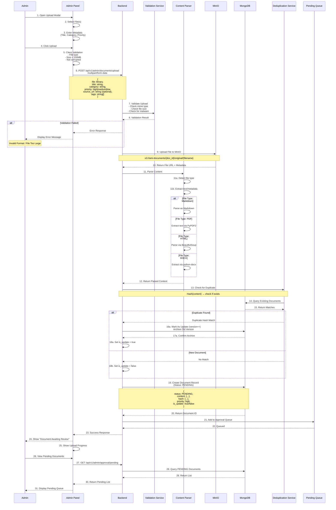
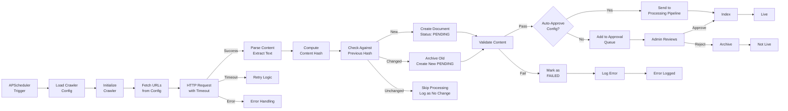
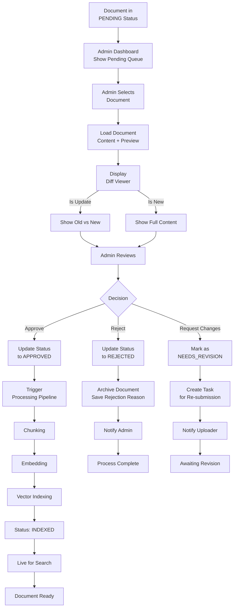
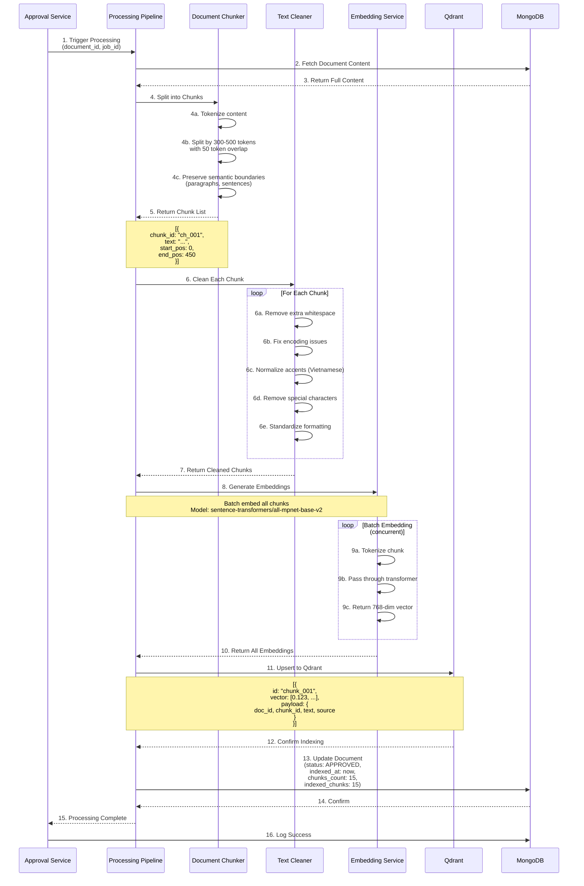

# COMPREHENSIVE DATA INGESTION WORKFLOW DOCUMENTATION

## Table of Contents
1. Data Ingestion Architecture
2. Manual Document Upload Flow
3. Web Crawler & Automated Ingestion
4. Document Approval Workflow
5. Processing Pipeline (Chunking & Embedding)
6. Vector Database Management
7. Document Versioning & History
8. Error Handling & Recovery
9. Monitoring & Analytics
10. Performance Optimization

---

## 1. Data Ingestion Architecture

### System Overview

```
Data Sources:
├─ Manual Upload (Admin)
├─ Web Crawlers (Scheduled)
├─ API Feeds
└─ CSV/Database Imports

         ↓

Ingestion Layer:
├─ File Upload Handler
├─ Content Parser (HTML/PDF/Markdown)
├─ URL Fetcher
└─ Crawler Scheduler

         ↓

Validation Layer:
├─ Format Check
├─ Content Validation
├─ Duplication Detection
└─ PII/Sensitive Content Check

         ↓

Pending Queue:
├─ PENDING status
├─ Ready for admin review
└─ Approval workflow

         ↓

Processing Pipeline:
├─ Chunking
├─ Text Cleaning
├─ Embedding Generation
└─ Vector Indexing

         ↓

Output:
├─ Qdrant (Vector DB)
├─ MongoDB (Metadata)
└─ Ready for Search
```

### Data Flow Layers

```
Layer 1: Source → Ingestion
         ↓
Layer 2: Ingestion → Validation
         ↓
Layer 3: Validation → Pending Queue
         ↓
Layer 4: Queue → Approval (Human/Auto)
         ↓
Layer 5: Approved → Processing
         ↓
Layer 6: Processing → Indexing
         ↓
Layer 7: Indexed → Live
         ↓
Layer 8: Monitoring & Analytics
```

---

## 2. Manual Document Upload Flow

### 2.1 Complete Upload Workflow



### 2.2 Upload API Endpoints

```
POST /api/v1/admin/documents/upload
├─ Request: multipart/form-data
│  ├─ file: File (Markdown, PDF, DOCX, HTML, TXT)
│  ├─ title: string (required)
│  ├─ category: string (admission, curriculum, regulation, etc.)
│  ├─ priority: enum (high, medium, low) - affects review order
│  ├─ source_url: string (optional, for tracking source)
│  ├─ tags: string[] (optional, for categorization)
│  └─ description: string (optional)
│
├─ Response: 200 OK
│  ├─ document_id: string
│  ├─ status: "pending"
│  ├─ message: "Document uploaded and queued for review"
│  └─ estimated_review_time: "2-4 hours"
│
└─ Error Codes:
   ├─ 400: Invalid file format / missing required fields
   ├─ 413: File too large
   ├─ 422: File corrupted
   └─ 503: Service unavailable

POST /api/v1/admin/documents/batch-upload
├─ Request: multipart/form-data (multiple files)
├─ Response: List of upload results
└─ Purpose: Upload multiple documents at once

GET /api/v1/admin/documents
├─ Query: ?status=pending|approved|rejected&category=&priority=
├─ Response: List of documents with pagination
└─ Purpose: List all documents with filters

GET /api/v1/admin/documents/{id}
├─ Response: Full document details
└─ Purpose: View single document details
```

### 2.3 Upload Validation Checklist

```json
{
  "validation_rules": [
    {
      "rule": "File Size",
      "check": "file.size_bytes <= 104857600",  // 100MB
      "error": "413 File too large"
    },
    {
      "rule": "File Type",
      "check": "file.mime_type in [application/pdf, text/markdown, ...]",
      "error": "400 Unsupported file type"
    },
    {
      "rule": "File Integrity",
      "check": "Can successfully parse file",
      "error": "422 File corrupted or unreadable"
    },
    {
      "rule": "Malware Scan",
      "check": "ClamAV or equivalent",
      "error": "400 File contains malicious content"
    },
    {
      "rule": "Required Fields",
      "check": "title && category present",
      "error": "400 Missing required fields"
    },
    {
      "rule": "Content Length",
      "check": "extracted_content.length > 100",  // Not just noise
      "error": "400 Document too short or empty"
    },
    {
      "rule": "Duplicate Check",
      "check": "hash(content) not in existing_docs",
      "note": "If duplicate: mark as update, not new doc"
    }
  ]
}
```

### 2.4 Document Metadata Model (Upload Stage)

```json
{
  "_id": ObjectId("507f1f77bcf86cd799439020"),
  "document_id": "doc_upload_20251226_001",
  "version": 1,
  
  "source": {
    "type": "manual_upload",           // manual_upload, crawler, api_feed
    "uploaded_by": "admin_user_123",
    "uploaded_at": ISODate("2025-12-26T10:00:00Z"),
    "source_url": null
  },
  
  "file_info": {
    "original_filename": "admission-requirements.md",
    "mime_type": "text/markdown",
    "size_bytes": 15234,
    "url": "s3://ami-documents/doc_upload_20251226_001/original/admission-requirements.md",
    "hash": {
      "sha256": "a3f8c2d5e9b1f4c7a2d5e8b1f4c7a0d3f6g9j2m5p8s1v4x7z0c3f6i9l2",
      "md5": "5d41402abc4b2a76b9719d911017c592"
    }
  },
  
  "metadata": {
    "title": "PTIT Admission Requirements 2025",
    "category": "admission",
    "priority": "high",
    "tags": ["admission", "2025", "requirements"],
    "description": "Complete requirements for admission to PTIT programs",
    "language": "en"
  },
  
  "status": "PENDING",
  "is_update": false,             // true if replaces existing doc
  "previous_version_id": null,    // Reference to previous version
  
  "content": {
    "raw": "..." ,                  // Full original content
    "extracted": "..."             // Cleaned content
  },
  
  "approval_info": {
    "assigned_to": null,
    "review_status": "unreviewed",  // unreviewed, in_review, approved, rejected
    "reviewed_by": null,
    "review_date": null,
    "approval_reason": null,
    "rejection_reason": null
  },
  
  "lifecycle": {
    "created_at": ISODate("2025-12-26T10:00:00Z"),
    "approved_at": null,
    "indexed_at": null,
    "archived_at": null,
    "deleted_at": null
  }
}
```

---

## 3. Web Crawler & Automated Ingestion

### 3.1 Complete Crawler Flow



### 3.2 Crawler Configuration Model

```json
{
  "crawler_id": "crawler_ptit_news_001",
  "name": "PTIT News Portal",
  
  "schedule": {
    "cron": "0 9 * * *",            // 9 AM daily
    "timezone": "Asia/Ho_Chi_Minh",
    "max_concurrent_crawls": 3,
    "timeout_seconds": 30
  },
  
  "target": {
    "base_url": "https://news.ptit.edu.vn",
    "max_depth": 2,                 // How many links deep to crawl
    "allowed_domains": ["news.ptit.edu.vn"],
    "excluded_patterns": ["/admin", "/api", "*.pdf"]
  },
  
  "content_extraction": {
    "selectors": {
      "title": "h1.article-title, h2.post-title",
      "content": "div.article-body, div.post-content",
      "date": "span.publish-date, meta[property='article:published_time']",
      "author": "span.author-name, meta[name='author']",
      "category": "span.category"
    },
    "parsing_method": "firecrawl",  // firecrawl, beautifulsoup4, selenium
    "javascript_render": false,      // true for JS-heavy sites
    "wait_for_selector": null        // CSS selector to wait for
  },
  
  "data_enrichment": {
    "auto_title_generation": true,
    "language_detection": true,
    "summary_generation": false     // Expensive, skip if not needed
  },
  
  "processing": {
    "auto_approve": true,           // Auto-approve without admin review
    "category": "news",
    "priority": "medium",
    "tags": ["ptit", "official", "auto-crawled"]
  },
  
  "deduplication": {
    "strategy": "content_hash",     // content_hash, url, semantic_similarity
    "semantic_threshold": 0.95      // If using semantic_similarity
  },
  
  "retention": {
    "keep_all_versions": false,
    "archive_after_days": 180,
    "delete_after_days": 365
  },
  
  "monitoring": {
    "enabled": true,
    "alert_on_failure": true,
    "log_level": "info"
  },
  
  "status": "active"                // active, paused, disabled
}
```

### 3.3 Crawler Execution Flow

```json
{
  "crawl_session": {
    "session_id": "crawl_session_20251226_090000",
    "crawler_id": "crawler_ptit_news_001",
    "started_at": ISODate("2025-12-26T09:00:00Z"),
    "completed_at": ISODate("2025-12-26T09:15:32Z"),
    "duration_seconds": 932,
    "status": "success",
    
    "fetch_phase": {
      "phase": 1,
      "urls_discovered": 150,
      "urls_fetched": 48,
      "fetch_errors": 2,
      "timeouts": 1,
      "duration_seconds": 300
    },
    
    "parse_phase": {
      "phase": 2,
      "items_parsed": 48,
      "parse_errors": 0,
      "avg_content_size_bytes": 8392,
      "duration_seconds": 150
    },
    
    "dedup_phase": {
      "phase": 3,
      "items_checked": 48,
      "new_items": 12,
      "updated_items": 5,
      "duplicates": 31,
      "duration_seconds": 50
    },
    
    "approval_phase": {
      "phase": 4,
      "auto_approved": 17,
      "pending_review": 0,
      "rejected_before_approval": 0,
      "duration_seconds": 32
    },
    
    "processing_phase": {
      "phase": 5,
      "items_chunked": 17,
      "chunks_generated": 89,
      "embeddings_generated": 89,
      "vector_insertions": 89,
      "duration_seconds": 300
    },
    
    "summary": {
      "total_items": 48,
      "new_documents": 12,
      "updated_documents": 5,
      "unchanged_documents": 31,
      "failed_to_process": 0,
      "final_indexed": 17
    },
    
    "errors": [
      {
        "url": "https://news.ptit.edu.vn/broken-link",
        "error_type": "404 Not Found",
        "timestamp": ISODate("2025-12-26T09:02:15Z")
      }
    ]
  }
}
```

### 3.4 Change Detection Strategy

```
Hash-Based Deduplication:

Step 1: Compute Hash
├─ Input: Full extracted content
├─ Algorithm: SHA-256
├─ Result: "a3f8c2d5e9b1f4c7a2d5e8b1f4c7a0d3"

Step 2: Lookup Previous Hash
├─ Query: SELECT previous_hash FROM documents WHERE url = ?
├─ Result: "b4g9d3e6f0c2g5d8b1e4h7k0n3q6t9" (different)

Step 3: Decision
├─ If same hash: SKIP (no change)
├─ If different hash: PROCESS (content updated)
├─ If no previous hash: NEW

Example Scenarios:
1. Article not updated: Same hash → Skip
2. Article edited: Different hash → Archive old, create new PENDING
3. New article: No previous → Create new PENDING
4. Article deleted from source: Still exists in DB (not auto-deleted)
```

---

## 4. Document Approval Workflow

### 4.1 Complete Approval Process



### 4.2 Approval Endpoints

```
GET /api/v1/admin/approval/pending
├─ Returns: List of PENDING documents
├─ Sorted by: priority, uploaded_at
└─ Pagination: limit=20, offset=0

GET /api/v1/admin/approval/{id}/detail
├─ Returns: Full document details
├─ Includes: Content, metadata, diff (if update)
└─ Format: HTML for preview, raw for diff

GET /api/v1/admin/approval/{id}/diff
├─ Returns: Side-by-side diff if update
├─ Highlights: Added, removed, modified sections
└─ Format: HTML with color coding

POST /api/v1/admin/approval/{id}/approve
├─ Request: { approver_id, approval_notes }
├─ Action: Update status to APPROVED, trigger processing
└─ Response: Processing job ID

POST /api/v1/admin/approval/{id}/reject
├─ Request: { rejection_reason, resubmission_allowed }
├─ Action: Update status to REJECTED, archive
└─ Response: Confirmation

GET /api/v1/admin/approval/stats
├─ Returns: Pending count, approval rate, avg review time
└─ Metrics: by category, by priority, by admin
```

### 4.3 Approval Data Model

```json
{
  "_id": ObjectId("507f1f77bcf86cd799439021"),
  "approval_id": "appr_20251226_001",
  "document_id": "doc_upload_20251226_001",
  
  "approval_info": {
    "created_at": ISODate("2025-12-26T10:00:00Z"),
    "assigned_to": null,            // Specific admin or null for queue
    "started_review_at": ISODate("2025-12-26T10:30:00Z"),
    "completed_at": ISODate("2025-12-26T10:45:00Z"),
    "review_duration_seconds": 900
  },
  
  "decision": {
    "status": "approved",           // approved, rejected, needs_revision
    "decided_by": "admin_user_456",
    "decision_timestamp": ISODate("2025-12-26T10:45:00Z")
  },
  
  "review_notes": {
    "content_accuracy": "verified",
    "completeness": "complete",
    "relevance": "highly_relevant",
    "comments": "Good quality document, verified with source"
  },
  
  "if_rejected": {
    "reason": "Contains outdated information",
    "reason_category": "inaccurate",
    "allow_resubmission": true,
    "feedback": "Please update dates to 2025 and resubmit"
  },
  
  "if_approved": {
    "processing_job_id": "job_123456",
    "chunks_created": 15,
    "embeddings_created": 15,
    "indexed_at": ISODate("2025-12-26T10:50:00Z")
  },
  
  "audit_trail": {
    "viewed_by": ["admin_user_789"],
    "view_timestamps": [ISODate("2025-12-26T10:20:00Z")],
    "changes_made": [
      {
        "change_type": "status_update",
        "from": "PENDING",
        "to": "APPROVED",
        "timestamp": ISODate("2025-12-26T10:45:00Z")
      }
    ]
  }
}
```

---

## 5. Processing Pipeline (Chunking & Embedding)

### 5.1 Complete Processing Flow



### 5.2 Chunking Strategy

```json
{
  "chunking_config": {
    "chunk_size": {
      "tokens": 400,
      "words": 200,
      "characters": 1600
    },
    "overlap": {
      "tokens": 50,
      "strategy": "sliding_window"
    },
    "boundary_strategy": [
      {
        "priority": 1,
        "separator": "\n\n",    // Paragraph boundary
        "reason": "Preserve semantic meaning"
      },
      {
        "priority": 2,
        "separator": "\n",       // Line boundary
        "reason": "Fallback if paragraph too long"
      },
      {
        "priority": 3,
        "separator": ".",        // Sentence boundary
        "reason": "Final fallback"
      }
    ],
    "special_handling": {
      "code_blocks": {
        "preserve": true,
        "treat_as_single_chunk": true,
        "reason": "Code coherence"
      },
      "tables": {
        "preserve": true,
        "treat_as_single_chunk": true,
        "reason": "Table structure"
      },
      "lists": {
        "split_by_item": true,
        "reason": "List item relevance"
      }
    }
  },
  
  "example_chunking": {
    "input_text": "PTIT is founded in 1956. It's a leading IT university. Students learn various subjects. IT is a core program.",
    "output_chunks": [
      {
        "chunk_id": "chunk_1",
        "text": "PTIT is founded in 1956. It's a leading IT university.",
        "token_count": 13,
        "position": "start"
      },
      {
        "chunk_id": "chunk_2",
        "text": "It's a leading IT university. Students learn various subjects. IT is a core program.",
        "token_count": 15,
        "position": "middle",
        "note": "Overlaps with chunk_1 by 4 tokens"
      },
      {
        "chunk_id": "chunk_3",
        "text": "Students learn various subjects. IT is a core program.",
        "token_count": 10,
        "position": "end",
        "note": "Overlaps with chunk_2 by 4 tokens"
      }
    ]
  }
}
```

### 5.3 Embedding Generation

```json
{
  "embedding_config": {
    "model": "sentence-transformers/all-mpnet-base-v2",
    "dimension": 768,
    "batch_size": 32,
    "device": "cuda",           // cuda, cpu
    "precision": "float32",     // float32, float16
    "optimization": {
      "quantization": false,    // true for production (smaller vectors)
      "caching": true           // Cache embeddings for repeated content
    }
  },
  
  "embedding_process": {
    "step_1_tokenization": {
      "method": "BertTokenizer",
      "max_length": 512,
      "padding": "max_length",
      "truncation": true
    },
    "step_2_model_forward_pass": {
      "input": "Tokenized chunk",
      "model_layers": 12,
      "attention_heads": 12,
      "output": "768-dim vector from [CLS] token"
    },
    "step_3_normalization": {
      "method": "L2 normalization",
      "reason": "For cosine similarity in vector DB"
    },
    "step_4_quality_check": {
      "check_nans": true,
      "check_magnitude": true,
      "reject_if_all_zeros": true
    }
  },
  
  "performance": {
    "throughput_chunks_per_second": 50,
    "avg_latency_ms_per_chunk": 20,
    "batch_embedding_time_seconds": 0.64
  }
}
```

### 5.4 Processing Error Handling

```
Error: Chunk Generation Failure
├─ Cause: Tokenizer issue
├─ Fallback: Retry with different tokenizer
├─ If Fail: Skip chunk, log error
└─ Impact: Partial indexing

Error: Embedding Service Timeout
├─ Timeout: Exceeds 30 seconds
├─ Action: Retry with smaller batch size
├─ If Fail: Use pre-computed embeddings or skip
└─ Impact: Document partially indexed

Error: Vector DB Connection Loss
├─ Detect: Connection refused
├─ Action: Retry with exponential backoff
├─ Queue: Store pending insertions
├─ Recovery: Batch insert when recovered
└─ Impact: Delayed indexing

Error: Out of Memory (OOM)
├─ Detect: GPU or system memory full
├─ Action: Reduce batch size dynamically
├─ Fallback: Use CPU instead of GPU
├─ If Persist: Process in smaller jobs
└─ Impact: Slower processing, still completes

Error: Invalid Content
├─ Cause: Corrupted text, encoding issues
├─ Action: Try UTF-8 decode, fallback encodings
├─ If Fail: Skip chunk
└─ Impact: Partial indexing
```

---

## 6. Vector Database Management

### 6.1 Qdrant Integration

```json
{
  "qdrant_config": {
    "host": "qdrant",
    "port": 6333,
    "api_key": "${QDRANT_API_KEY}",
    "collection_name": "ami_documents",
    
    "collection_config": {
      "vectors": {
        "size": 768,              // Embedding dimension
        "distance": "Cosine"      // Cosine similarity
      },
      "quantization": {
        "enabled": true,
        "type": "int8"
      },
      "hnsw_config": {
        "m": 16,                  // Number of connections
        "ef_construct": 200,      // Construction parameter
        "full_scan_threshold": 10000
      }
    },
    
    "payload_schema": {
      "doc_id": "string",
      "chunk_id": "string",
      "text": "string",
      "source": "string",
      "category": "string",
      "indexed_at": "datetime",
      "version": "integer"
    }
  }
}
```

### 6.2 Vector Indexing Operations

```
Operation: Upsert (Insert or Update)
├─ Check: If chunk_id exists
├─ If Exists: Replace vector and payload
├─ If Not: Insert new
├─ Benefit: Idempotent, safe for retries
└─ Batch Upsert: 1000 vectors at a time

Operation: Search
├─ Query: chunk_embedding (768 dims)
├─ Method: HNSW (Hierarchical Navigable Small World)
├─ Top-K: Return top 20 nearest neighbors
├─ Filters: Can filter by category, doc_id, etc.
└─ Latency: < 200ms for 1M vectors

Operation: Delete
├─ Trigger: Document rejected/deleted
├─ Query: DELETE WHERE doc_id = {id}
├─ Cleanup: Remove all chunks for document
└─ Vacuum: Defragment space after deletion

Operation: Maintenance
├─ Index Optimization: Periodic rebuild
├─ Statistics: Monitor index health
├─ Backup: Regular snapshots
└─ Monitoring: Query latency, cache hit rate
```

### 6.3 Vector Search Query

```json
{
  "search_request": {
    "collection_name": "ami_documents",
    "vector": [0.123, -0.456, 0.789, ...],  // Query embedding
    "limit": 20,
    "with_payload": true,
    "with_vectors": false,                  // Don't return vectors
    "score_threshold": 0.7,                 // Minimum similarity
    "filter": {
      "must": [
        {
          "key": "category",
          "match": {
            "value": "admission"
          }
        }
      ],
      "must_not": [
        {
          "key": "status",
          "match": {
            "value": "archived"
          }
        }
      ]
    }
  },
  
  "search_results": [
    {
      "id": "chunk_001",
      "score": 0.92,              // Similarity score
      "payload": {
        "doc_id": "doc_123",
        "chunk_id": "chunk_001",
        "text": "PTIT admission requires...",
        "source": "admission-requirements.md",
        "category": "admission"
      }
    },
    {
      "id": "chunk_002",
      "score": 0.85,
      "payload": { ... }
    }
  ]
}
```

---

## 7. Document Versioning & History

### 7.1 Version Management

```
Document Lifecycle:
├─ Upload Document v1
│  ├─ Status: PENDING
│  └─ Waiting for approval
│
├─ Approve & Index v1
│  ├─ Status: APPROVED
│  ├─ Chunks indexed: 15
│  └─ Live since: 2025-12-26 10:50
│
├─ Upload Updated Content (v2)
│  ├─ Detected as update (hash changed)
│  ├─ v1 archived automatically
│  ├─ v2 Status: PENDING
│  └─ Waiting for approval
│
├─ Approve & Index v2
│  ├─ Status: APPROVED
│  ├─ Old chunks (v1) deleted from vector DB
│  ├─ New chunks (v2) indexed: 18
│  └─ Live since: 2025-12-26 11:00
│
└─ Maintain History
   ├─ v1 document: Status ARCHIVED
   ├─ v2 document: Status APPROVED (current)
   └─ Search only finds v2 (current)
```

### 7.2 Version Data Model

```json
{
  "document_with_versions": {
    "document_id": "doc_admission_req",
    "current_version": 2,
    "versions": [
      {
        "version": 1,
        "status": "archived",
        "created_at": ISODate("2025-12-20T09:00:00Z"),
        "approved_at": ISODate("2025-12-20T09:30:00Z"),
        "archived_at": ISODate("2025-12-26T11:00:00Z"),
        "reason_archived": "Superseded by v2",
        "content_hash": "a3f8c2d5e9b1f4c7a2d5e8b1f4c7a0d3",
        "chunks_indexed": 15
      },
      {
        "version": 2,
        "status": "approved",
        "created_at": ISODate("2025-12-26T10:00:00Z"),
        "approved_at": ISODate("2025-12-26T10:50:00Z"),
        "is_current": true,
        "content_hash": "b4g9d3e6f0c2g5d8b1e4h7k0n3q6t9w2",
        "chunks_indexed": 18,
        "changes_from_v1": {
          "added_sections": ["New Programs 2025"],
          "modified_sections": ["Requirements Updated"],
          "removed_sections": []
        }
      }
    ]
  }
}
```

---

## 8. Error Handling & Recovery

### 8.1 Ingestion Error Hierarchy

```
Critical Errors (Stop Processing):
├─ Corrupted File: Can't parse at all
├─ Malware Detected: Security risk
├─ Invalid Configuration: Can't proceed
└─ Recovery: Manual intervention required

Non-Critical Errors (Continue with Fallback):
├─ Parsing Error on One Section: Skip that section
├─ Embedding Timeout: Retry with smaller batch
├─ Vector DB Unavailable: Queue for later
└─ Recovery: Automatic retry or fallback

Warnings (Log but Continue):
├─ Content length unusual
├─ Encoding issues detected
├─ PII might be present
└─ Recovery: Proceed but flag for review
```

### 8.2 Recovery Strategies

```json
{
  "recovery_strategies": {
    "file_parse_error": {
      "trigger": "Cannot extract content from file",
      "attempts": [
        {
          "attempt": 1,
          "action": "Try alternate parser",
          "example": "If PDF fails, try OCR"
        },
        {
          "attempt": 2,
          "action": "Try encoding conversion",
          "example": "Try UTF-8, Latin-1, etc."
        },
        {
          "attempt": 3,
          "action": "Manual review required",
          "escalation": "Notify admin"
        }
      ]
    },
    
    "embedding_timeout": {
      "trigger": "Embedding service > 30s",
      "attempts": [
        {
          "attempt": 1,
          "action": "Reduce batch size (32 → 16)",
          "delay": 2000
        },
        {
          "attempt": 2,
          "action": "Use smaller model",
          "delay": 2000
        },
        {
          "attempt": 3,
          "action": "Queue for async processing",
          "delay": 60000
        }
      ]
    },
    
    "vector_db_unavailable": {
      "trigger": "Connection to Qdrant failed",
      "strategy": "Circuit breaker + queue",
      "actions": [
        {
          "immediate": "Queue document for retry",
          "retry_after_seconds": 300
        },
        {
          "status": "Document marked as PENDING_INDEX",
          "user_impact": "Not yet searchable"
        },
        {
          "background_job": "Retry every 5 minutes",
          "max_retries": 48,
          "timeout_if_fail": 24
        }
      ]
    }
  }
}
```

---

## 9. Monitoring & Analytics

### 9.1 Ingestion Metrics

```
Real-time Metrics:
├─ Documents in PENDING: 23
├─ Documents APPROVED: 1,456
├─ Crawls completed today: 12
├─ Avg approval time: 2.3 hours
├─ Processing queue size: 18 documents
├─ Vector DB size: 45,230 chunks
└─ Total indexed vectors: 45,230

Performance Metrics:
├─ Avg chunking time: 0.5s per MB
├─ Avg embedding time: 20ms per chunk
├─ Avg indexing time: 15ms per vector
├─ Semantic search latency (p95): 180ms
├─ BM25 search latency (p95): 250ms
└─ Total pipeline time: 2-5s per document

Quality Metrics:
├─ Parse success rate: 99.2%
├─ Duplicate detection accuracy: 98.7%
├─ Embedding generation success: 99.8%
├─ Document approval rate: 87%
├─ Rejection rate: 8%
└─ Resubmission rate: 5%

Health Checks:
├─ Vector DB: Healthy
├─ MongoDB: Healthy
├─ MinIO: Healthy
├─ Embedding Service: Healthy
└─ Crawler: Last run 2 hours ago (OK)
```

### 9.2 Monitoring Endpoints

```
GET /api/v1/admin/analytics/ingestion
├─ Returns: Real-time ingestion metrics
├─ Metrics: Pending count, approval stats, processing status
└─ Cache: 1 minute

GET /api/v1/admin/analytics/crawler
├─ Returns: Crawler health and history
├─ Includes: Last run time, success rate, errors
└─ Cache: 5 minutes

GET /api/v1/admin/analytics/vector-db
├─ Returns: Vector DB statistics
├─ Includes: Total vectors, chunks per document, search latency
└─ Cache: 5 minutes

GET /api/v1/admin/analytics/documents
├─ Returns: Document statistics by category
├─ Breakdown: Total, approved, archived, by category
└─ Cache: 1 hour

POST /api/v1/admin/health-check
├─ Returns: Health status of all services
├─ Services: MongoDB, Qdrant, MinIO, LLM, Embeddings
└─ Timeout: 5 seconds
```

---

## 10. Performance Optimization

### 10.1 Caching Strategy

```
Layer 1: Content Hash Cache (Fast Dedup)
├─ Type: Redis
├─ Key: hash(content)
├─ TTL: 30 days
├─ Purpose: Instant duplicate detection
└─ Size: < 1MB per 1000 documents

Layer 2: Embedding Cache
├─ Type: Redis
├─ Key: hash(chunk_id + text)
├─ TTL: Never expires
├─ Purpose: Avoid re-embedding same content
└─ Size: ~ 3KB per vector (768 dims)

Layer 3: Document Metadata Cache
├─ Type: In-memory
├─ Key: document_id
├─ TTL: 1 hour
├─ Purpose: Fast metadata lookup
└─ Size: ~ 10KB per document

Layer 4: Search Results Cache
├─ Type: Redis
├─ Key: hash(query_vector)
├─ TTL: 24 hours
├─ Purpose: Cache popular searches
└─ Size: ~ 100KB per search result set
```

### 10.2 Scaling Considerations

```
Vertical Scaling (Single Server):
├─ Increase CPU cores (faster embedding)
├─ Increase RAM (cache more data)
├─ GPU acceleration (20x faster embedding)
├─ Fast NVMe storage (faster file I/O)
└─ Limit: Single server bottleneck at ~10k docs/day

Horizontal Scaling (Multiple Servers):
├─ Multiple crawler instances (parallel crawling)
├─ Worker pool for processing (parallel chunking)
├─ LLM inference service (distributed)
├─ Redis cluster (distributed caching)
├─ MongoDB replica set (read scaling)
└─ Qdrant cluster (search scaling)

Database Optimization:
├─ Index on: document_id, status, category, created_at
├─ Sharding by: document_id or category
├─ Archive old documents (cold storage)
├─ Vacuum & defragment regularly
└─ Monitor: Query execution plans

Vector DB Optimization:
├─ Batch inserts (1000 vectors at a time)
├─ Pre-computed quantization (8-bit)
├─ HNSW parameters tuning
├─ Regular vacuum and rebalance
└─ Replication for failover
```

### 10.3 SLA Targets

```
Ingestion SLA:

Upload to PENDING:        < 5 seconds (P95)
Upload to Indexed:        < 5 minutes (P95) - if auto-approved
Crawler execution:        < 15 minutes (P95) per crawl
Approval to Indexed:      < 30 seconds (P95)
Full pipeline latency:    < 6 seconds (P95) per document
Crawler to Live:          < 30 minutes (P95)

Availability:
├─ 99.9% uptime (data ingestion)
├─ 99.5% uptime (search indexing)
├─ RPO (Recovery Point Objective): 1 hour
└─ RTO (Recovery Time Objective): 30 minutes
```

---

## Summary: Integration Points

1. **Upload Handler → Validator:** Validate file format and content
2. **Validator → File Store (MinIO):** Save raw file
3. **File Store → Parser:** Extract content from file
4. **Parser → Deduplication Service:** Detect if content is duplicate
5. **Deduplication → MongoDB:** Store as PENDING document
6. **Pending Queue → Approval UI:** Admin reviews content
7. **Approval → Processing Pipeline:** Trigger chunking and embedding
8. **Processing Pipeline → Chunker:** Split content into chunks
9. **Chunker → Embedding Service:** Generate vectors
10. **Embedding Service → Vector DB (Qdrant):** Index vectors
11. **Vector DB → Search Interface:** Ready for semantic search
12. **MongoDB → Analytics:** Track metrics and statistics

All components must:
- Validate inputs thoroughly
- Implement comprehensive error handling
- Log all important events
- Support graceful degradation
- Monitor performance metrics
- Scale horizontally when needed
- Maintain audit trails
- Support rollback/recovery

