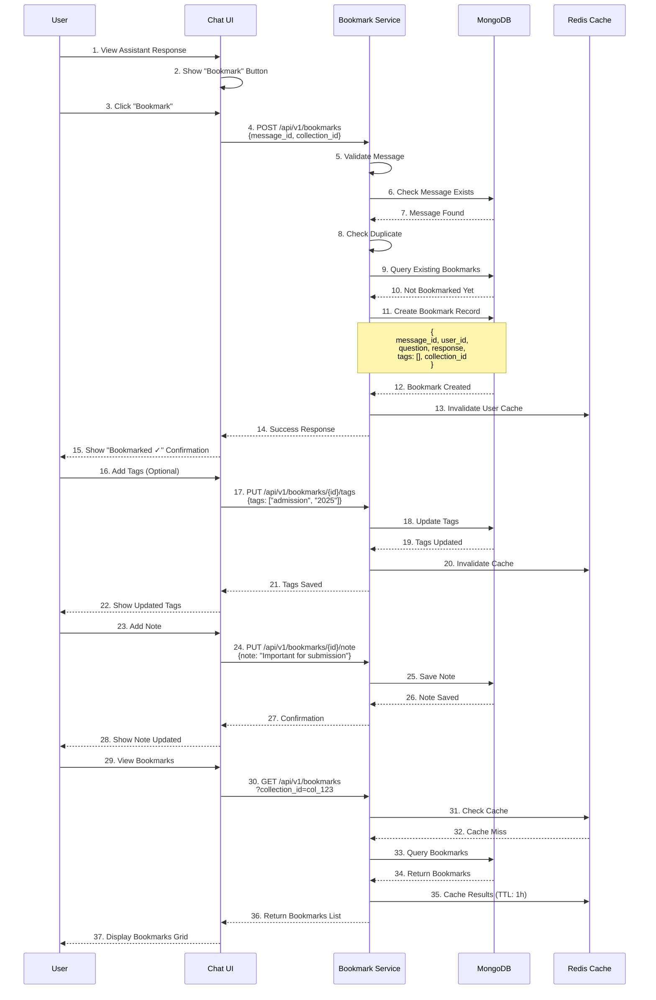
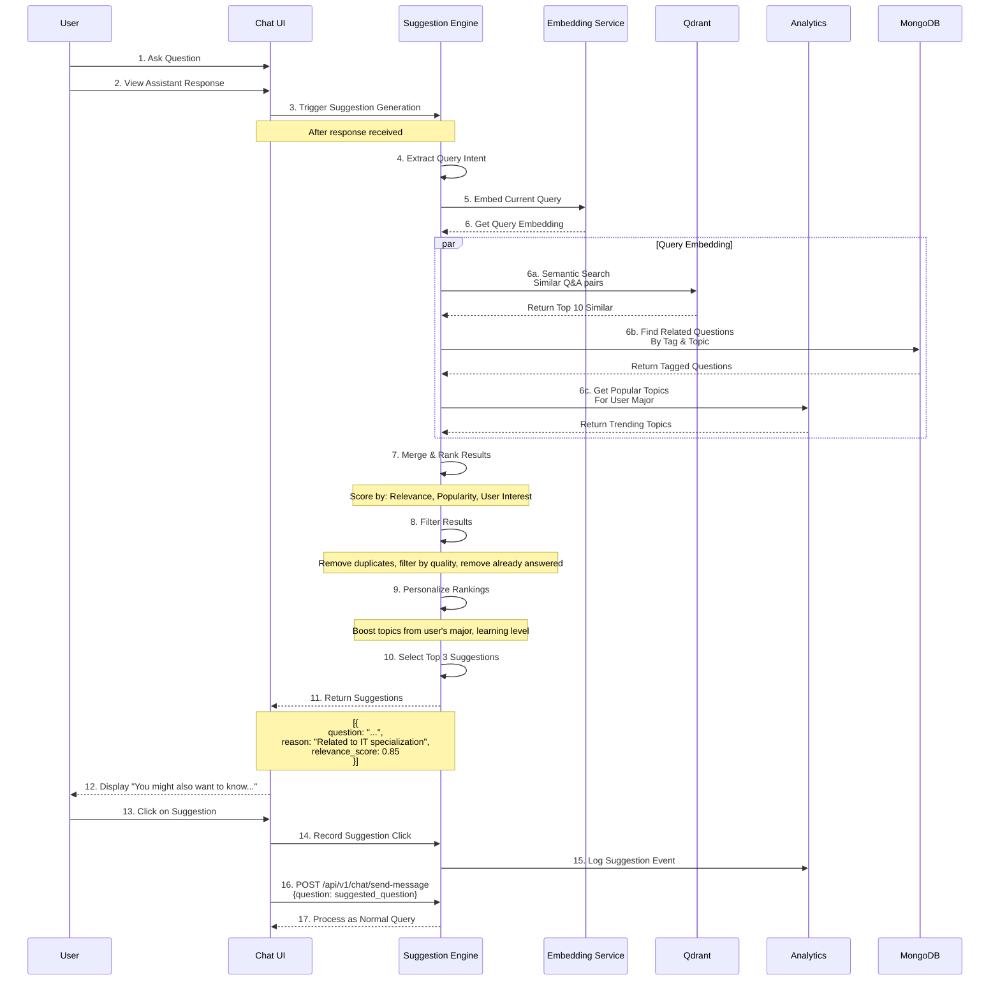

# USER FEATURES - BOOKMARKS & SUGGESTIONS WORKFLOW DOCUMENTATION

## Table of Contents
1. Bookmark & Save Q&A (UC-013)
2. Smart Suggestions & Related Questions (UC-014)
3. Bookmark Architecture
4. Suggestion Algorithms
5. Integration with Chat
6. Error Handling & Recovery
7. Performance Optimization

---

## 1. Bookmark & Save Q&A (UC-013)

### 1.1 Overview

Allow students to save important Q&A pairs with custom tags, notes, and personal collections for quick reference.

### 1.2 Complete Bookmark Flow



### 1.3 Bookmark Data Model

```json
{
  "bookmark": {
    "_id": ObjectId("507f1f77bcf86cd799439040"),
    "bookmark_id": "bm_a1b2c3d4e5f6g7h8",
    
    "ownership": {
      "user_id": "user_12345",
      "created_at": ISODate("2025-12-26T10:00:00Z"),
      "updated_at": ISODate("2025-12-26T11:00:00Z")
    },
    
    "source": {
      "session_id": "sess_x1y2z3a4b5c6d7e8",
      "message_id": "msg_001",
      "timestamp": ISODate("2025-12-26T09:30:00Z")
    },
    
    "content": {
      "question": "What are the admission requirements for IT specialization?",
      "response": "The IT specialization requires... [full response text]",
      "response_summary": "Key requirements: GPA 3.5+, specific courses required",
      "citations": [
        {
          "document_id": "doc_001",
          "document_title": "IT Program Requirements",
          "chunk_id": "chunk_123",
          "relevance_score": 0.95
        }
      ]
    },
    
    "metadata": {
      "collection_id": "col_123",
      "tags": ["admission", "it-specialization", "2025"],
      "note": "Important for my application",
      "custom_title": "IT Admission Rules",
      "is_favorite": true,
      "view_count": 5,
      "last_viewed": ISODate("2025-12-26T11:00:00Z")
    },
    
    "quality": {
      "original_rating": 5,
      "helpful_count": 0,
      "used_in_application": true,
      "follow_up_questions": ["Can I apply without those prerequisites?"]
    }
  },
  
  "bookmark_collection": {
    "_id": ObjectId("507f1f77bcf86cd799439041"),
    "collection_id": "col_123",
    
    "info": {
      "user_id": "user_12345",
      "name": "Admission 2025",
      "description": "All Q&A about 2025 admission process",
      "color": "#FF6B6B",
      "icon": "bookmark"
    },
    
    "structure": {
      "total_bookmarks": 42,
      "created_at": ISODate("2025-12-01T00:00:00Z"),
      "updated_at": ISODate("2025-12-26T11:00:00Z"),
      "is_public": false,
      "shared_with": [],
      "sort_order": "newest_first"
    },
    
    "tags": [
      {
        "tag": "admission",
        "count": 15,
        "color": "#FF6B6B"
      },
      {
        "tag": "it-specialization",
        "count": 12,
        "color": "#4ECDC4"
      },
      {
        "tag": "deadlines",
        "count": 8,
        "color": "#FFE66D"
      }
    ]
  }
}
```

### 1.4 Bookmark Endpoints

```
POST /api/v1/bookmarks
├─ Request: {
     "message_id": "msg_001",
     "collection_id": "col_123",
     "custom_title": "My saved Q&A"
   }
├─ Returns: Bookmark created
└─ Response: {
     "bookmark_id": "bm_001",
     "created_at": "2025-12-26T10:00:00Z",
     "status": "created"
   }

GET /api/v1/bookmarks
├─ Query: ?collection_id=col_123&tags=admission,deadline&search=
├─ Returns: Paginated bookmarks list
├─ Cache: 1 hour
├─ Pagination: limit=20, offset=0
└─ Response: [{
     "bookmark_id": "bm_001",
     "question": "...",
     "response_summary": "...",
     "tags": ["admission"],
     "created_at": "2025-12-26T10:00:00Z"
   }]

GET /api/v1/bookmarks/{id}
├─ Returns: Full bookmark with original response
├─ Includes: Formatting, citations, links
└─ Response: {
     "bookmark_id": "bm_001",
     "question": "...",
     "response": "...",
     "tags": ["admission"],
     "note": "Important for my application",
     "citations": [...]
   }

PUT /api/v1/bookmarks/{id}
├─ Request: {
     "custom_title": "Updated title",
     "collection_id": "col_456",
     "is_favorite": true
   }
├─ Returns: Bookmark updated
└─ Response: { "status": "updated" }

PUT /api/v1/bookmarks/{id}/tags
├─ Request: { "tags": ["admission", "2025", "new-tag"] }
├─ Returns: Tags updated
└─ Response: { "tags": ["admission", "2025", "new-tag"] }

PUT /api/v1/bookmarks/{id}/note
├─ Request: { "note": "My personal notes about this Q&A" }
├─ Returns: Note saved
└─ Response: { "note_updated": true }

DELETE /api/v1/bookmarks/{id}
├─ Returns: Bookmark deleted
└─ Response: { "status": "deleted" }

POST /api/v1/bookmarks/search
├─ Request: {
     "query": "admission requirements",
     "collections": ["col_123", "col_456"],
     "tags": ["admission"],
     "date_range": {"start": "2025-12-01", "end": "2025-12-26"}
   }
├─ Returns: Search results
└─ Response: [{
     "bookmark_id": "bm_001",
     "question": "...",
     "matched_field": "question",
     "relevance_score": 0.92
   }]

POST /api/v1/bookmarks/{id}/export
├─ Request: { "format": "pdf|markdown|json" }
├─ Returns: Export URL
├─ Async: Email when ready
└─ Response: {
     "export_id": "exp_001",
     "url": "s3://exports/bookmark_001.pdf",
     "format": "pdf"
   }

POST /api/v1/bookmarks/collections
├─ Request: {
     "name": "Admission 2025",
     "description": "All admission-related Q&A",
     "color": "#FF6B6B"
   }
├─ Returns: Collection created
└─ Response: { "collection_id": "col_123" }

GET /api/v1/bookmarks/collections
├─ Returns: All user's collections
├─ Includes: Count of bookmarks per collection
└─ Response: [{
     "collection_id": "col_123",
     "name": "Admission 2025",
     "bookmark_count": 42,
     "updated_at": "2025-12-26T11:00:00Z"
   }]

PUT /api/v1/bookmarks/collections/{id}
├─ Request: { "name": "Updated name", "color": "#4ECDC4" }
├─ Returns: Collection updated
└─ Response: { "status": "updated" }

DELETE /api/v1/bookmarks/collections/{id}
├─ Request: { "move_bookmarks_to": "col_456" }
├─ Returns: Collection deleted
└─ Response: { "status": "deleted", "bookmarks_moved": 42 }
```

---

## 2. Smart Suggestions & Related Questions (UC-014)

### 2.1 Overview

Recommend related questions during conversations to help students explore comprehensive answers and discover relevant topics they might not think to ask about.

### 2.2 Complete Suggestion Flow



### 2.3 Suggestion Data Model

```json
{
  "suggestion_record": {
    "_id": ObjectId("507f1f77bcf86cd799439042"),
    "suggestion_id": "sug_a1b2c3d4e5f6g7h8",
    
    "context": {
      "user_id": "user_12345",
      "session_id": "sess_x1y2z3a4b5c6d7e8",
      "message_id": "msg_001",
      "generated_at": ISODate("2025-12-26T10:00:00Z"),
      "trigger_query": "What are IT specialization requirements?"
    },
    
    "suggestions": [
      {
        "rank": 1,
        "suggested_question": "What courses are included in IT curriculum?",
        "reason": "Related to IT specialization",
        "reason_type": "semantic_similarity",
        "relevance_score": 0.87,
        "source_message_id": "msg_456",
        "source_session_id": "sess_789",
        "popularity_score": 0.72,
        "popularity_rank": 3,
        "user_interest_score": 0.91,
        "final_score": 0.83
      },
      {
        "rank": 2,
        "suggested_question": "How to apply for scholarships?",
        "reason": "Popular question from IT students",
        "reason_type": "popularity_segment",
        "relevance_score": 0.65,
        "popularity_score": 0.95,
        "user_interest_score": 0.70,
        "final_score": 0.77
      },
      {
        "rank": 3,
        "suggested_question": "What are internship opportunities?",
        "reason": "Trending topic this week",
        "reason_type": "trending",
        "relevance_score": 0.58,
        "popularity_score": 0.88,
        "user_interest_score": 0.65,
        "final_score": 0.70
      }
    ],
    
    "engagement": {
      "clicked": true,
      "clicked_rank": 1,
      "clicked_at": ISODate("2025-12-26T10:05:00Z"),
      "time_to_click_seconds": 35,
      "is_relevant": true,
      "user_satisfaction": 5
    }
  },
  
  "trending_topic": {
    "_id": ObjectId("507f1f77bcf86cd799439043"),
    "topic_id": "topic_admission_2025",
    
    "info": {
      "topic": "2025 Admission Process",
      "category": "admission",
      "related_tags": ["admission", "2025", "application", "requirements"],
      "first_seen": ISODate("2025-12-20T00:00:00Z")
    },
    
    "metrics": {
      "query_count_24h": 234,
      "query_count_7d": 1456,
      "trend_direction": "increasing",
      "growth_rate_24h": 0.18,
      "trend_strength": 0.85,
      "rank_overall": 1,
      "rank_by_segment": {
        "new_students": 1,
        "graduating_students": 8,
        "it_students": 2
      }
    },
    
    "related_questions": [
      {
        "question": "What are the basic admission requirements?",
        "frequency": 156,
        "avg_rating": 4.4
      },
      {
        "question": "What's the application deadline?",
        "frequency": 142,
        "avg_rating": 4.2
      }
    ]
  }
}
```

### 2.4 Suggestion Algorithm

```
SUGGESTION_GENERATION_ALGORITHM:

Input: user_query, user_profile, current_session

1. EXTRACT_INTENT(user_query)
   → intent = {topic, subtopic, query_type}

2. SEMANTIC_SEARCH(user_query)
   → similar_questions = vector_db.search(
       embedding(user_query),
       top_k=10,
       filters={quality > 0.7}
     )

3. TAG_BASED_SEARCH(user_query)
   → tagged_questions = mongodb.find(
       tags={related_tags},
       rating_avg > 4.0,
       limit=10
     )

4. POPULARITY_SEARCH(user_profile)
   → popular_questions = analytics.trending_questions(
       major=user_profile.major,
       time_window="7d",
       limit=10
     )

5. PERSONALIZE_RANKING():
   FOR EACH question IN (similar + tagged + popular):
     relevance_score = semantic_similarity(user_query, question)
     popularity_score = (query_count / max_count) * trend_strength
     interest_score = predict_user_interest(user_profile, question)
     
     final_score = (
       0.5 * relevance_score +
       0.3 * popularity_score +
       0.2 * interest_score
     )

6. FILTER_RESULTS():
   - Remove duplicates
   - Remove questions user already asked
   - Remove questions below quality threshold (0.6)
   - Keep top 5 candidates

7. PERSONALIZE_DISPLAY():
   FOR EACH candidate:
     IF (candidate_topic MATCHES user_major):
       priority_boost = 0.15
     IF (candidate IN bookmarks OR recent_searches):
       priority_boost = 0.10
     final_score += priority_boost

8. SELECT_TOP_3():
   suggestions = sort(candidates, by=final_score)
   RETURN suggestions[0:3]

OUTPUT: [{question, reason, relevance_score}]
```

### 2.5 Suggestion Endpoints

```
GET /api/v1/suggestions
├─ Query: ?session_id=sess_001&message_id=msg_001&limit=3
├─ Returns: Top N suggestions for current query
├─ Cache: Not cached (real-time)
├─ Calculate: Semantic similarity + popularity + interest
└─ Response: [{
     "question": "...",
     "reason": "Related to IT specialization",
     "relevance_score": 0.87,
     "click_probability": 0.42
   }]

POST /api/v1/suggestions/{id}/feedback
├─ Request: {
     "helpful": true|false,
     "rating": 1-5,
     "reason": "Too similar to previous"
   }
├─ Returns: Feedback recorded
├─ Impact: Improves suggestion ranking for user
└─ Response: { "status": "recorded" }

GET /api/v1/trending-topics
├─ Query: ?time_window=24h|7d|30d&major=&limit=10
├─ Returns: Trending topics sorted by query volume
├─ Cache: 1 hour
└─ Response: [{
     "topic": "2025 Admission Process",
     "query_count_24h": 234,
     "trend_direction": "increasing",
     "rank": 1
   }]

GET /api/v1/trending-topics/{topic}/related-questions
├─ Returns: Top questions about a trending topic
├─ Sorted: By frequency, quality rating
└─ Response: [{
     "question": "What are the requirements?",
     "frequency": 156,
     "avg_rating": 4.4
   }]

GET /api/v1/user/suggestions-history
├─ Returns: Past suggestions & their engagement
├─ Includes: Click-through rate, satisfaction
├─ Helps: Improve future suggestions
└─ Response: [{
     "suggestion_id": "sug_001",
     "suggested_question": "...",
     "clicked": true,
     "user_satisfaction": 5
   }]
```

---

## 3. Bookmark Architecture

### 3.1 Storage Strategy

```
MongoDB Collections:
├─ bookmarks
│  └─ Indexed: user_id, created_at, collection_id, tags
├─ bookmark_collections
│  └─ Indexed: user_id, created_at
└─ bookmark_analytics
   └─ Metrics: export count, view count, sharing

Redis Cache:
├─ Key: "bookmarks:user_123:*"
├─ TTL: 1 hour
└─ Invalidation: On create/update/delete
```

### 3.2 Search Strategy

```
Full-text Search:
├─ Index fields: question, response_summary, tags, note
├─ Storage: MongoDB text index
├─ Ranking: By relevance, recency

Tag-based Search:
├─ Query: db.bookmarks.find({tags: {$in: [tag1, tag2]}})
├─ Performance: O(1) with index
└─ Combined with: Text search for filtering

Pagination:
├─ Limit: 20 per page
└─ Offset: limit * (page - 1)
```

---

## 4. Suggestion Algorithms

### 4.1 Hybrid Recommendation Approach

```
Step 1: Semantic Similarity (50% weight)
├─ Embed current query
├─ Search Qdrant for similar Q&A
└─ Score by cosine similarity

Step 2: Popularity Analysis (30% weight)
├─ Count query frequency by segment
├─ Trend detection (gaining momentum)
└─ Score by (frequency + trend_strength)

Step 3: User Interest Prediction (20% weight)
├─ User's major/interests
├─ Recent queries & bookmarks
├─ User segment behavior
└─ Score by predicted relevance
```

### 4.2 Cold Start Problem

```
For New Users (No History):
├─ Use content-based filtering only
├─ Rely on semantic similarity
├─ Show trending topics from their major
└─ Learn user preferences over time

For New Questions:
├─ Use semantic similarity + popularity
├─ No user engagement data yet
└─ Gradually gather data
```

---

## 5. Integration Points

### 5.1 Chat Integration

```
Message Structure:
{
  "message_id": "msg_001",
  "user_message": "Original question",
  "assistant_response": "Full response",
  
  "bookmarkable": true,
  "suggestions": [{...}]
}
```

### 5.2 UI Components

```
Chat UI Changes:
├─ Add "Bookmark" button to responses
├─ Show bookmark confirmation
├─ Display "You might also want to know"
├─ Link to bookmarks in sidebar
└─ Show saved bookmarks in sidebar

Bookmarks Page:
├─ List view with search
├─ Collection management
├─ Tag cloud visualization
├─ Export options
└─ Quick preview
```

---

## 6. Error Handling

```
Error: Bookmark Already Exists
├─ Check: Existing bookmark for same message
├─ Action: Return existing bookmark ID
├─ Message: "This Q&A is already bookmarked"
└─ UX: Show option to view existing bookmark

Error: Collection Not Found
├─ Check: Collection ownership
├─ Response: 404 Not Found
└─ Message: "Collection no longer exists"

Error: Suggestion Generation Failed
├─ Fallback: Return empty suggestions (OK)
├─ Message: No suggestion UI shown
├─ Log: Suggestion generation error
└─ Alert: If > 5% fail rate

Error: Search Timeout
├─ Timeout: Bookmark search > 10 seconds
├─ Action: Return partial results
├─ Message: "Showing first results, may be incomplete"
└─ Log: Search timeout event
```

---

## 7. Performance Targets

| Operation | Target |
|-----------|--------|
| Create bookmark | < 500ms |
| List bookmarks | < 2 seconds |
| Search bookmarks | < 5 seconds |
| Generate suggestions | < 1 second |
| Trending topics load | < 2 seconds |

---

## 8. Bookmark Lifecycle Example

```
User Flow:
1. Ask: "What's the IT specialization?"
2. Get response: "The IT specialization requires..."
3. Click "Bookmark"
   → Bookmark created with message_id & user_id
4. Add tags: ["it", "specialization", "2025"]
   → Bookmark updated with tags
5. Add note: "Important for choosing major"
   → Bookmark updated with note
6. Add to collection: "Program Planning"
   → Collection assignment updated
7. Later, search: "IT curriculum"
   → Bookmark appears in search results
8. Export collection: PDF downloaded
   → Collection exported to file

Result: Student has organized, searchable reference
```

