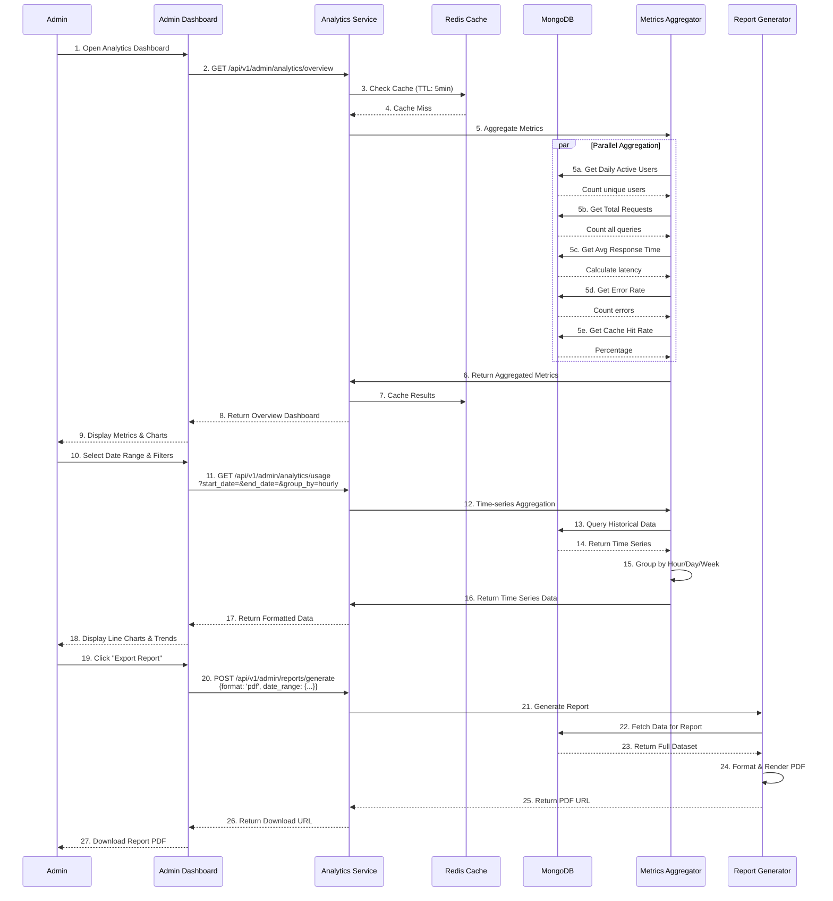
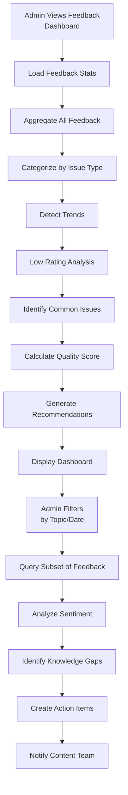
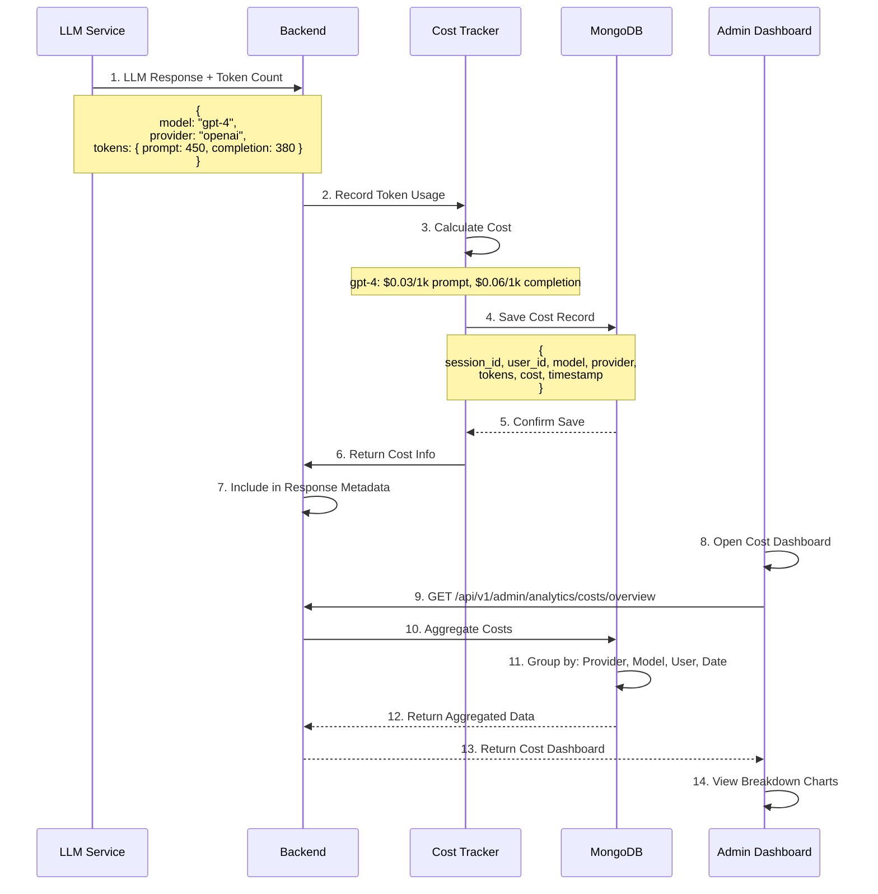
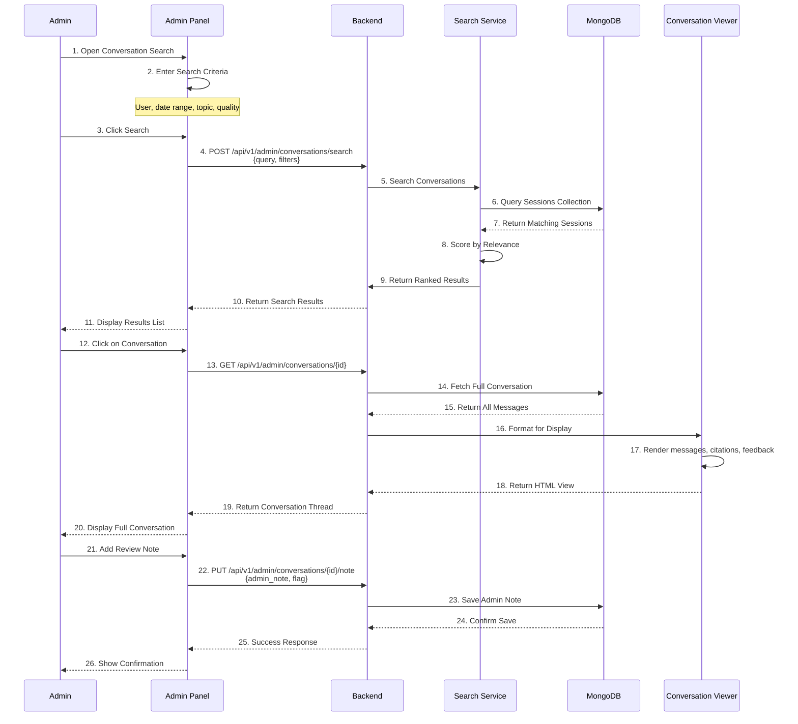
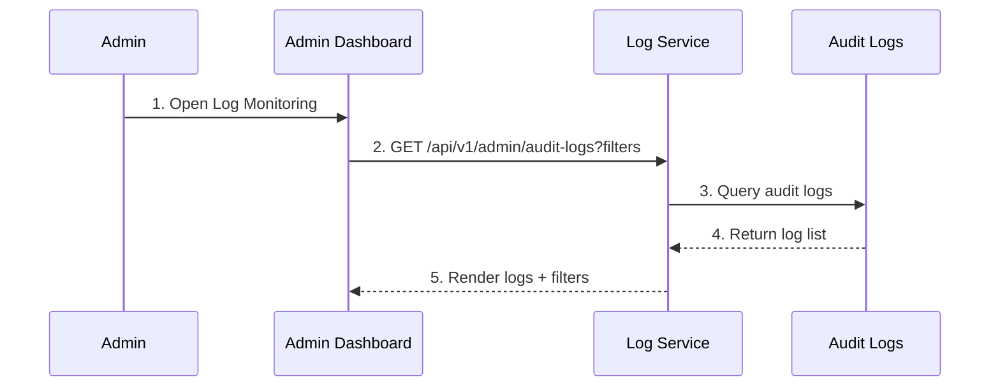

# ADMIN ANALYTICS & MONITORING WORKFLOW DOCUMENTATION

## Table of Contents
1. Admin Analytics Dashboard (UC-015)
2. Feedback Analytics Dashboard (UC-016)
3. Cost & LLM Usage Tracking (UC-017)
4. Conversation History Review (UC-019)
5. Analytics Architecture
6. Error Handling
7. Performance Targets
8. Security & Audit Log Monitoring (UC-022)

---

## 1. Admin Analytics Dashboard (UC-015)

### 1.1 Overview

Comprehensive system analytics for administrators to monitor usage, performance, costs, and system health.

### 1.2 Complete Analytics Flow



### 1.3 Analytics Data Model

```json
{
  "analytics_record": {
    "_id": ObjectId("507f1f77bcf86cd799439030"),
    "timestamp": ISODate("2025-12-26T11:00:00Z"),
    "period": "2025-12-26T11:00:00Z",
    
    "usage_metrics": {
      "total_queries": 1234,
      "unique_users": 456,
      "total_sessions": 678,
      "avg_queries_per_user": 2.7,
      "peak_hour": 11,
      "peak_hour_queries": 245
    },
    
    "performance_metrics": {
      "avg_response_time_ms": 2340,
      "p50_latency_ms": 1850,
      "p95_latency_ms": 5200,
      "p99_latency_ms": 8900,
      "cache_hit_rate": 0.42,
      "semantic_search_latency_ms": 850,
      "llm_generation_latency_ms": 3200
    },
    
    "quality_metrics": {
      "avg_feedback_rating": 4.3,
      "positive_feedback_rate": 0.78,
      "negative_feedback_rate": 0.12,
      "avg_document_retrieval_count": 8.2,
      "zero_result_queries": 23,
      "zero_result_rate": 0.019
    },
    
    "error_metrics": {
      "total_errors": 12,
      "error_rate": 0.0097,
      "errors_by_type": {
        "validation_errors": 3,
        "auth_errors": 1,
        "service_unavailable": 5,
        "timeout_errors": 3,
        "other": 0
      },
      "vector_db_errors": 5,
      "llm_errors": 3,
      "mongodb_errors": 2
    },
    
    "document_metrics": {
      "total_documents": 1456,
      "approved_documents": 1401,
      "pending_documents": 23,
      "archived_documents": 32,
      "total_chunks": 45230,
      "avg_chunk_size_bytes": 1024,
      "vector_db_size_mb": 125
    },
    
    "engagement_metrics": {
      "returning_users": 234,
      "new_users": 222,
      "session_abandonment_rate": 0.15,
      "avg_session_duration_min": 8.3,
      "sessions_with_feedback": 234,
      "feedback_rate": 0.345
    }
  }
}
```

### 1.4 Analytics Endpoints

```
GET /api/v1/admin/analytics/overview
├─ Returns: High-level metrics summary
├─ Fields: DAU, total requests, avg latency, error rate
├─ Cache: 5 minutes
└─ Response: {
     "dau": 456,
     "total_requests": 1234,
     "avg_response_time_ms": 2340,
     "error_rate": 0.0097,
     "cache_hit_rate": 0.42
   }

GET /api/v1/admin/analytics/usage
├─ Query: ?start_date=2025-12-20&end_date=2025-12-26&group_by=daily
├─ Returns: Time-series usage data
├─ Group by: hourly, daily, weekly, monthly
└─ Response: [{
     "timestamp": "2025-12-26T00:00:00Z",
     "users": 456,
     "queries": 1234,
     "sessions": 678
   }]

GET /api/v1/admin/analytics/performance
├─ Returns: Response time metrics by operation
├─ Breakdown: By endpoint, by query type, by model
├─ Percentiles: P50, P95, P99
└─ Response: {
     "semantic_search": { "p95": 850, "p99": 1200 },
     "llm_generation": { "p95": 5200, "p99": 8900 },
     "message_save": { "p95": 100, "p99": 200 }
   }

GET /api/v1/admin/analytics/quality
├─ Returns: Quality metrics (ratings, feedback, retrieval quality)
├─ Breakdown: By topic, by model, by user segment
└─ Response: {
     "avg_rating": 4.3,
     "positive_rate": 0.78,
     "avg_retrieval_count": 8.2
   }

GET /api/v1/admin/analytics/errors
├─ Returns: Error rate & breakdown by type
├─ Breakdown: By service, by error code, over time
└─ Response: [{
     "timestamp": "2025-12-26T11:00:00Z",
     "total_errors": 12,
     "error_rate": 0.0097,
     "errors_by_type": { "timeout": 5, "validation": 3 }
   }]

GET /api/v1/admin/analytics/health
├─ Returns: Real-time service health status
├─ Services: MongoDB, Qdrant, LLM, Embeddings, STT
├─ Status: Healthy, Degraded, Down
└─ Response: {
     "mongodb": { "status": "healthy", "latency_ms": 12 },
     "qdrant": { "status": "healthy", "latency_ms": 85 },
     "llm": { "status": "degraded", "latency_ms": 8900 }
   }

GET /api/v1/admin/reports
├─ Returns: List of generated reports
├─ Pagination: limit=20, offset=0
└─ Response: [{
     "report_id": "rpt_001",
     "generated_at": "2025-12-26T10:00:00Z",
     "format": "pdf",
     "file_size_mb": 2.3,
     "url": "s3://reports/rpt_001.pdf"
   }]

POST /api/v1/admin/reports/generate
├─ Request: {
     "format": "pdf|csv|json",
     "start_date": "2025-12-20",
     "end_date": "2025-12-26",
     "include_sections": ["usage", "performance", "quality", "errors"],
     "email": "admin@ptit.edu.vn"
   }
├─ Response: { "report_id": "rpt_001", "status": "generating" }
└─ Email: Report sent when ready
```

---

## 2. Feedback Analytics Dashboard (UC-016)

### 2.1 Complete Feedback Analytics Flow



### 2.2 Feedback Analytics Data Model

```json
{
  "feedback_analytics": {
    "_id": ObjectId("507f1f77bcf86cd799439031"),
    "period": "2025-12-26",
    "aggregated_at": ISODate("2025-12-27T01:00:00Z"),
    
    "summary": {
      "total_feedback": 234,
      "rating_distribution": {
        "5_stars": 145,
        "4_stars": 62,
        "3_stars": 18,
        "2_stars": 7,
        "1_star": 2
      },
      "sentiment_distribution": {
        "positive": 178,
        "neutral": 38,
        "negative": 18
      },
      "avg_rating": 4.3,
      "nps_score": 68
    },
    
    "issue_analysis": {
      "issues_by_category": [
        {
          "category": "inaccurate",
          "count": 15,
          "percentage": 0.064,
          "trend": "increasing",
          "trend_change": 0.08,
          "examples": [
            "Wrong admission date provided",
            "Incorrect curriculum info"
          ]
        },
        {
          "category": "incomplete",
          "count": 8,
          "percentage": 0.034,
          "trend": "stable"
        },
        {
          "category": "irrelevant",
          "count": 5,
          "percentage": 0.021,
          "trend": "decreasing"
        }
      ]
    },
    
    "topic_analysis": {
      "topics_by_feedback": [
        {
          "topic": "admission",
          "total_feedback": 89,
          "avg_rating": 4.1,
          "low_rating_count": 8,
          "positive_rate": 0.75
        },
        {
          "topic": "curriculum",
          "total_feedback": 56,
          "avg_rating": 4.4,
          "low_rating_count": 3,
          "positive_rate": 0.82
        },
        {
          "topic": "deadlines",
          "total_feedback": 34,
          "avg_rating": 4.2,
          "low_rating_count": 2,
          "positive_rate": 0.79
        }
      ]
    },
    
    "knowledge_gaps": [
      {
        "gap_id": "gap_001",
        "description": "Student asking about 2026 admission dates, getting 2025 info",
        "frequency": 12,
        "confidence_score": 0.68,
        "recommended_action": "Update admission requirements document",
        "severity": "high"
      },
      {
        "gap_id": "gap_002",
        "description": "Questions about IT specialization options, limited answers",
        "frequency": 8,
        "confidence_score": 0.72,
        "recommended_action": "Add specialization overview document",
        "severity": "medium"
      }
    ],
    
    "quality_metrics": {
      "query_difficulty_score": 0.65,
      "response_quality_score": 0.78,
      "accuracy_score": 0.82,
      "completeness_score": 0.75,
      "relevance_score": 0.79
    },
    
    "trends": {
      "weekly_trend": "improving",
      "rating_trend_change": 0.12,
      "issue_trend_change": -0.08,
      "positivity_trend": "increasing",
      "prediction": "Rating will reach 4.5 by end of month"
    }
  }
}
```

### 2.3 Feedback Analytics Endpoints

```
GET /api/v1/admin/analytics/feedback/summary
├─ Returns: Feedback overview metrics
├─ Metrics: Total feedback, rating distribution, NPS
└─ Response: {
     "total_feedback": 234,
     "avg_rating": 4.3,
     "nps_score": 68,
     "positive_rate": 0.76
   }

GET /api/v1/admin/analytics/feedback/trends
├─ Query: ?start_date=&end_date=&group_by=daily
├─ Returns: Rating trends over time
├─ Detects: Improving/declining patterns
└─ Response: [{
     "date": "2025-12-26",
     "avg_rating": 4.3,
     "positive_count": 178,
     "trend": "improving"
   }]

GET /api/v1/admin/analytics/feedback/categories
├─ Returns: Feedback breakdown by issue category
├─ Categories: accurate, complete, relevant, helpful
└─ Response: [{
     "category": "inaccurate",
     "count": 15,
     "percentage": 0.064,
     "trend": "increasing"
   }]

GET /api/v1/admin/analytics/feedback/topics
├─ Returns: Feedback by topic/subject
├─ Topics: admission, curriculum, deadlines, etc.
└─ Response: [{
     "topic": "admission",
     "total_feedback": 89,
     "avg_rating": 4.1,
     "low_rating_count": 8
   }]

GET /api/v1/admin/analytics/knowledge-gaps
├─ Returns: Identified gaps in knowledge base
├─ Calculation: Low confidence queries, repeated questions
├─ Recommendations: Content to add/update
└─ Response: [{
     "gap": "2026 admission dates",
     "frequency": 12,
     "recommendation": "Update admission doc"
   }]

GET /api/v1/admin/analytics/quality-metrics
├─ Returns: Overall quality scores
├─ Metrics: Accuracy, completeness, relevance
└─ Response: {
     "accuracy_score": 0.82,
     "completeness_score": 0.75,
     "relevance_score": 0.79
   }

POST /api/v1/admin/analytics/feedback/filter
├─ Request: {
     "topic": "admission",
     "rating_range": [1, 3],
     "date_range": {"start": "2025-12-20", "end": "2025-12-26"}
   }
├─ Returns: Filtered feedback messages
└─ Response: [{
     "message_id": "msg_001",
     "rating": 2,
     "comment": "Wrong dates provided"
   }]
```

---

## 3. Cost & LLM Usage Tracking (UC-017)

### 3.1 Complete Cost Tracking Flow



### 3.2 Cost Data Model

```json
{
  "cost_record": {
    "_id": ObjectId("507f1f77bcf86cd799439032"),
    "cost_id": "cost_001",
    
    "usage": {
      "provider": "openai",
      "model": "gpt-4",
      "tokens": {
        "prompt": 450,
        "completion": 380,
        "total": 830
      }
    },
    
    "pricing": {
      "prompt_price_per_1k": 0.03,
      "completion_price_per_1k": 0.06,
      "prompt_cost": 0.0135,
      "completion_cost": 0.0228,
      "total_cost": 0.0363
    },
    
    "context": {
      "session_id": "sess_a1b2c3d4e5f6g7h8",
      "user_id": "user_12345",
      "message_id": "msg_001",
      "query_type": "text|voice|image",
      "timestamp": ISODate("2025-12-26T11:00:00Z")
    }
  },
  
  "cost_summary": {
    "_id": ObjectId("507f1f77bcf86cd799439033"),
    "period": "2025-12-26",
    
    "total_cost": 125.45,
    
    "cost_by_provider": {
      "openai": {
        "total_cost": 95.30,
        "request_count": 1234,
        "avg_cost_per_request": 0.0773
      },
      "anthropic": {
        "total_cost": 20.15,
        "request_count": 234,
        "avg_cost_per_request": 0.0861
      },
      "google": {
        "total_cost": 10.00,
        "request_count": 145,
        "avg_cost_per_request": 0.0690
      }
    },
    
    "cost_by_model": {
      "gpt-4": {
        "total_cost": 65.20,
        "request_count": 789,
        "avg_cost_per_request": 0.0827
      },
      "gpt-3.5-turbo": {
        "total_cost": 30.10,
        "request_count": 445,
        "avg_cost_per_request": 0.0677
      },
      "claude-opus": {
        "total_cost": 15.45,
        "request_count": 189,
        "avg_cost_per_request": 0.0818
      }
    },
    
    "cost_by_user": [
      {
        "user_id": "user_12345",
        "total_cost": 5.32,
        "request_count": 78,
        "avg_rating": 4.3
      },
      {
        "user_id": "user_67890",
        "total_cost": 4.15,
        "request_count": 62,
        "avg_rating": 4.1
      }
    ],
    
    "cost_trends": {
      "daily_average_cost": 125.45,
      "weekly_trend": "increasing",
      "trend_change_percent": 0.12,
      "forecast_monthly_cost": 3763.50,
      "budget_status": "on_track"
    }
  }
}
```

### 3.3 Cost Tracking Endpoints

```
GET /api/v1/admin/analytics/costs/overview
├─ Returns: Total cost for period
├─ Breakdown: By provider, by model
└─ Response: {
     "total_cost": 125.45,
     "avg_cost_per_request": 0.0776,
     "cost_by_provider": {
       "openai": 95.30,
       "anthropic": 20.15,
       "google": 10.00
     }
   }

GET /api/v1/admin/analytics/costs/by-provider
├─ Query: ?start_date=&end_date=&provider=
├─ Returns: Detailed costs per provider
├─ Metrics: Request count, avg cost, trend
└─ Response: [{
     "provider": "openai",
     "total_cost": 95.30,
     "request_count": 1234,
     "avg_cost_per_request": 0.0773,
     "trend": "increasing"
   }]

GET /api/v1/admin/analytics/costs/by-model
├─ Query: ?provider=openai&start_date=&end_date=
├─ Returns: Cost breakdown by model within provider
└─ Response: [{
     "model": "gpt-4",
     "total_cost": 65.20,
     "tokens_used": 234567,
     "avg_cost_per_token": 0.000278
   }]

GET /api/v1/admin/analytics/costs/by-user
├─ Returns: Cost attribution per user
├─ Helps: Identify heavy users, manage quotas
└─ Response: [{
     "user_id": "user_12345",
     "total_cost": 5.32,
     "request_count": 78,
     "queries_by_model": { "gpt-4": 45, "gpt-3.5": 33 }
   }]

POST /api/v1/admin/budgets
├─ Request: {
     "budget_id": "budget_001",
     "provider": "openai",
     "monthly_limit_usd": 1000,
     "alert_threshold_percent": 80
   }
├─ Returns: Budget created
└─ Response: { "budget_id": "budget_001", "status": "active" }

GET /api/v1/admin/budgets/{id}
├─ Returns: Budget details & current spending
├─ Status: On track, Over budget, etc.
└─ Response: {
     "budget_id": "budget_001",
     "monthly_limit": 1000,
     "current_spending": 750,
     "percent_used": 0.75,
     "status": "on_track"
   }

PUT /api/v1/admin/budgets/{id}
├─ Request: { "monthly_limit_usd": 1500 }
├─ Returns: Updated budget
└─ Response: { "budget_id": "budget_001", "new_limit": 1500 }

POST /api/v1/admin/budget-alerts
├─ Request: { "budget_id": "budget_001", "alert_email": "admin@ptit.edu.vn" }
├─ Returns: Alert created
└─ Triggers: When spending exceeds threshold
```

---

## 4. Conversation History Review (UC-019)

### 4.1 Complete Review Flow



### 4.2 Conversation Review Data Model

```json
{
  "conversation_review": {
    "_id": ObjectId("507f1f77bcf86cd799439034"),
    "session_id": "sess_a1b2c3d4e5f6g7h8",
    "user_id": "user_12345",
    
    "basic_info": {
      "title": "Questions about Admission",
      "created_at": ISODate("2025-12-26T10:00:00Z"),
      "message_count": 8,
      "duration_minutes": 45,
      "last_activity": ISODate("2025-12-26T10:45:00Z")
    },
    
    "quality_analysis": {
      "avg_message_rating": 4.2,
      "positive_feedback_count": 6,
      "negative_feedback_count": 1,
      "low_quality_messages": 1,
      "quality_score": 0.78,
      "requires_review": false
    },
    
    "content_analysis": {
      "topics_discussed": ["admission", "requirements", "deadlines"],
      "documents_referenced": [
        "admission-requirements.md",
        "academic-calendar.md"
      ],
      "retrieval_quality": "good",
      "accuracy_score": 0.85
    },
    
    "flag_info": {
      "flagged": false,
      "flag_category": null,
      "flag_reason": null,
      "flagged_by": null,
      "flagged_at": null,
      "flag_categories": [
        "low_quality",
        "offensive_content",
        "pii_detected",
        "misinformation",
        "requires_followup"
      ]
    },
    
    "admin_notes": [
      {
        "note_id": "note_001",
        "added_by": "admin_user_123",
        "timestamp": ISODate("2025-12-26T11:00:00Z"),
        "text": "Good conversation, student got helpful responses",
        "type": "general"
      },
      {
        "note_id": "note_002",
        "added_by": "admin_user_456",
        "timestamp": ISODate("2025-12-26T11:05:00Z"),
        "text": "Check if 2026 admission dates need update",
        "type": "action_item"
      }
    ],
    
    "privacy_check": {
      "contains_pii": false,
      "pii_detected_items": [],
      "user_consent_for_review": true,
      "compliance_status": "compliant"
    },
    
    "export_info": {
      "exported": true,
      "export_format": "pdf",
      "export_date": ISODate("2025-12-26T11:10:00Z"),
      "export_url": "s3://exports/session_export_001.pdf"
    }
  }
}
```

### 4.3 Conversation Review Endpoints

```
POST /api/v1/admin/conversations/search
├─ Request: {
     "query": "free text search",
     "filters": {
       "user_id": "user_12345",
       "date_range": {"start": "2025-12-20", "end": "2025-12-26"},
       "topic": "admission",
       "quality_score_range": [0, 0.5],
       "has_flag": false
     },
     "sort_by": "quality_score|date|relevance"
   }
├─ Returns: Paginated conversation list
├─ Pagination: limit=20, offset=0
└─ Response: [{
     "session_id": "sess_001",
     "title": "...",
     "message_count": 8,
     "quality_score": 0.78,
     "flagged": false
   }]

GET /api/v1/admin/conversations/{id}
├─ Returns: Full conversation with all metadata
├─ Includes: Messages, citations, feedback, admin notes
└─ Response: {
     "session_id": "sess_a1b2c3d4e5f6g7h8",
     "messages": [...],
     "quality_score": 0.78,
     "admin_notes": [...]
   }

PUT /api/v1/admin/conversations/{id}/note
├─ Request: {
     "text": "Admin review comment",
     "type": "general|action_item|warning"
   }
├─ Returns: Note created
└─ Response: {
     "note_id": "note_001",
     "added_at": "2025-12-26T11:00:00Z"
   }

POST /api/v1/admin/conversations/{id}/flag
├─ Request: {
     "category": "low_quality|offensive|pii|misinformation",
     "reason": "Detailed reason for flag"
   }
├─ Returns: Flag created
└─ Response: { "flagged": true, "category": "low_quality" }

DELETE /api/v1/admin/conversations/{id}/flag
├─ Request: (No body)
├─ Returns: Flag removed
└─ Response: { "flagged": false }

POST /api/v1/admin/conversations/{id}/export
├─ Request: { "format": "pdf|csv|json" }
├─ Returns: Export job status
├─ Async: Email when ready
└─ Response: {
     "export_id": "exp_001",
     "status": "generating",
     "estimated_time_seconds": 30
   }

GET /api/v1/admin/conversations/{id}/export-status
├─ Returns: Export job status
├─ If ready: Download URL
└─ Response: {
     "status": "completed",
     "url": "s3://exports/session_export_001.pdf"
   }
```

---

## 5. Analytics Architecture

### 5.1 Real-time Metrics Pipeline

```
User Query
    ↓
Capture Metrics (latency, tokens, errors)
    ↓
Send to Metrics Collector (Redis)
    ↓
Batch Aggregation (every 1 minute)
    ↓
Store in MongoDB
    ↓
Serve via API (cached 5 minutes)
```

### 5.2 Aggregation Strategies

```json
{
  "aggregation_config": {
    "real_time": {
      "storage": "Redis",
      "retention": "1 hour",
      "granularity": "by second"
    },
    "short_term": {
      "storage": "MongoDB",
      "retention": "30 days",
      "granularity": "hourly",
      "aggregation": "batch (every 1h)"
    },
    "long_term": {
      "storage": "MongoDB (cold storage)",
      "retention": "2 years",
      "granularity": "daily",
      "aggregation": "batch (nightly)"
    }
  }
}
```

---

## 6. Error Handling

```
Error: Database Query Timeout
├─ Timeout: Aggregation query > 30s
├─ Action: Return cached data if available
├─ Message: "Analytics data may be outdated"
└─ Log: Query timeout event

Error: Missing Data Point
├─ Cause: Some metrics not recorded
├─ Action: Interpolate or skip data point
├─ Impact: Small gap in chart
└─ Log: Data gap detected

Error: Permission Denied
├─ Check: User role is admin
├─ Response: 403 Forbidden
└─ Log: Unauthorized access attempt
```

---

## 7. Performance Targets

| Metric | Target |
|--------|--------|
| Analytics overview load | < 2 seconds |
| Feedback dashboard load | < 3 seconds |
| Detailed report generation | < 60 seconds |
| Cost calculation accuracy | 99.9% |
| Search conversation latency | < 5 seconds |

---

## 8. Security & Audit Log Monitoring (UC-022)

### 8.1 Overview

Provide admin visibility into security events and admin/manager actions.
This supports incident response and accountability when roles change, data sources are updated, or API keys are rotated.

### 8.2 Log Monitoring Flow



### 8.3 Signals to Monitor

- Failed admin access attempts (403/401)
- Invalid client API key usage
- Changes to roles, users, and system config
- High error rates from specific clients or IPs

### 8.4 Example Queries

```
GET /api/v1/admin/audit-logs?action=config.update&start_date=2025-12-01
GET /api/v1/admin/audit-logs?actor_role=manager&target_type=datasource
```
