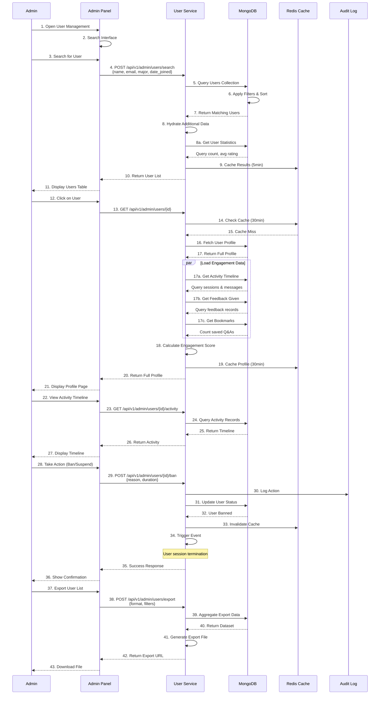
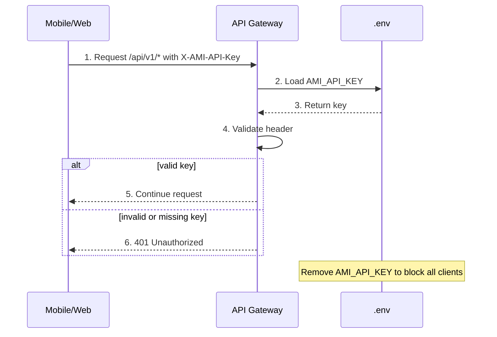
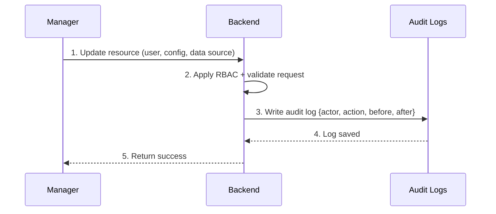

# ADMIN FEATURES - USER MANAGEMENT & ENGAGEMENT WORKFLOW DOCUMENTATION

## Table of Contents
1. User Management & Engagement (UC-018)
2. User Search & Filtering
3. Engagement Analytics
4. User Actions & Controls
5. Privacy & Compliance
6. Error Handling & Recovery
7. Performance Optimization
8. Access Control & Client API Key (UC-021)
9. Audit Log & Change Tracking (UC-022)
10. User Management Lifecycle Example

---

## 1. User Management & Engagement (UC-018)

### 1.1 Overview

Provide administrators with comprehensive tools to search user profiles, monitor engagement metrics, manage access, and ensure platform health and compliance.
This includes role-based access (admin/manager/user), admin-only account creation, and mandatory profile completion before using chat features.

**Key rules:**
- Default admin account exists in MongoDB and can be updated by admin.
- Only admin can create new accounts or assign roles.
- Manager can access admin panel but cannot create admins or modify system roles.
- Users cannot access admin panel and do not see admin navigation.

### 1.2 Complete User Management Flow



### 1.3 User Profile Data Model

```json
{
  "user_profile": {
    "_id": ObjectId("507f1f77bcf86cd799439050"),
    "user_id": "user_12345",
    
    "basic_info": {
      "email": "student@ptit.edu.vn",
      "full_name": "Nguyễn Văn A",
      "student_id": "20190123",
      "phone": "+84912345678",
      "created_at": ISODate("2024-09-15T10:00:00Z"),
      "last_login": ISODate("2025-12-26T10:30:00Z"),
      "status": "active|suspended|banned|archived"
    },
    
    "academic_info": {
      "major": "Information Technology",
      "year": "Junior",
      "specialization": "Artificial Intelligence",
      "gpa": 3.75,
      "enrollment_status": "full_time"
    },
    
    "preferences": {
      "language": "vi",
      "response_length": "medium",
      "receive_notifications": true,
      "theme": "light",
      "newsletter": true
    },
    
    "engagement_metrics": {
      "total_queries": 234,
      "total_sessions": 89,
      "avg_session_duration_min": 12.3,
      "last_query_date": ISODate("2025-12-26T10:00:00Z"),
      "active_days_count": 45,
      "active_days_30d": 18,
      "engagement_score": 0.72,
      "engagement_level": "high"
    },
    
    "quality_metrics": {
      "avg_response_rating": 4.3,
      "feedback_given_count": 23,
      "positive_feedback_percent": 0.78,
      "sessions_with_bookmark": 12,
      "saved_qa_count": 34,
      "response_quality_score": 0.82
    },
    
    "usage_patterns": {
      "preferred_topics": ["admission", "curriculum", "deadlines"],
      "topic_distribution": {
        "admission": 0.35,
        "curriculum": 0.28,
        "deadlines": 0.22,
        "other": 0.15
      },
      "peak_usage_hour": 14,
      "peak_usage_day": "Wednesday",
      "avg_queries_per_day": 2.6,
      "query_frequency_trend": "increasing"
    },
    
    "access_control": {
      "role": "student",
      "status": "active",
      "banned": false,
      "suspend_until": null,
      "ban_reason": null,
      "ban_date": null,
      "last_action_by": null
    },
    
    "privacy": {
      "consent_to_collect_data": true,
      "consent_to_analytics": true,
      "data_retention_choice": "delete_after_1_year",
      "last_updated": ISODate("2024-09-15T10:00:00Z")
    },
    
    "metadata": {
      "registration_source": "web",
      "referral_code": "REF123",
      "tags": ["high_engagement", "satisfied_user"],
      "internal_notes": "VIP user - very engaged"
    }
  },

  "user_activity": {
    "_id": ObjectId("507f1f77bcf86cd799439051"),
    "user_id": "user_12345",
    "date": "2025-12-26",
    
    "daily_stats": {
      "queries": 5,
      "sessions": 2,
      "session_duration_min": 45,
      "messages": 12,
      "feedback_given": 2,
      "bookmarks_created": 1
    },
    
    "timeline": [
      {
        "timestamp": ISODate("2025-12-26T10:00:00Z"),
        "activity_type": "query",
        "details": {
          "query": "What's the IT specialization?",
          "session_id": "sess_001",
          "response_time_ms": 2340
        }
      },
      {
        "timestamp": ISODate("2025-12-26T10:05:00Z"),
        "activity_type": "bookmark",
        "details": {
          "message_id": "msg_001",
          "collection_id": "col_123"
        }
      },
      {
        "timestamp": ISODate("2025-12-26T10:10:00Z"),
        "activity_type": "feedback",
        "details": {
          "message_id": "msg_001",
          "rating": 5,
          "category": "accurate"
        }
      }
    ]
  }
}
```

### 1.4 User Search & Filtering

```json
{
  "search_query": {
    "filters": {
      "name": "Nguyễn",
      "email": "ptit.edu.vn",
      "major": "Information Technology",
      "year": [2, 3],
      "status": ["active", "suspended"],
      "joined_date_range": {
        "start": "2024-09-01",
        "end": "2025-12-31"
      },
      "last_login_range": {
        "start": "2025-12-01",
        "end": "2025-12-31"
      },
      "engagement_level": ["high", "medium"],
      "tags": ["high_engagement"]
    },
    "sort": {
      "field": "last_login|engagement_score|created_at|name",
      "direction": "desc"
    },
    "pagination": {
      "limit": 50,
      "offset": 0
    }
  },

  "search_results": {
    "total_count": 1234,
    "filtered_count": 89,
    "users": [
      {
        "user_id": "user_12345",
        "name": "Nguyễn Văn A",
        "email": "student@ptit.edu.vn",
        "major": "Information Technology",
        "year": 3,
        "last_login": "2025-12-26T10:30:00Z",
        "engagement_score": 0.72,
        "status": "active",
        "total_queries": 234
      }
    ]
  }
}
```

### 1.5 User Management Endpoints

```
POST /api/v1/admin/users/search
├─ Request: {
     "name": "Nguyễn",
     "major": "IT",
     "status": ["active"],
     "engagement_level": ["high", "medium"],
     "sort": {"field": "last_login", "direction": "desc"},
     "pagination": {"limit": 50, "offset": 0}
   }
├─ Returns: Paginated user list
├─ Cache: 5 minutes
├─ Performance: < 2 seconds
└─ Response: [{
     "user_id": "user_12345",
     "name": "...",
     "email": "...",
     "major": "IT",
     "engagement_score": 0.72,
     "last_login": "2025-12-26T10:30:00Z",
     "total_queries": 234
   }]

GET /api/v1/admin/users/{id}
├─ Returns: Complete user profile
├─ Includes: Academic info, engagement metrics, activity
├─ Cache: 30 minutes
├─ Performance: < 1 second
└─ Response: {
     "user_id": "user_12345",
     "basic_info": {...},
     "academic_info": {...},
     "engagement_metrics": {...},
     "activity_timeline": [...],
     "recent_queries": [...]
   }

GET /api/v1/admin/users/{id}/activity
├─ Query: ?start_date=2025-12-20&end_date=2025-12-26&type=
├─ Returns: User activity timeline
├─ Activity Types: query, session, feedback, bookmark
├─ Pagination: limit=100, offset=0
└─ Response: [{
     "timestamp": "2025-12-26T10:00:00Z",
     "activity_type": "query",
     "details": {
       "query": "What's the IT specialization?",
       "rating": 5
     }
   }]

PUT /api/v1/admin/users/{id}
├─ Request: {
     "internal_notes": "Updated notes",
     "tags": ["high_engagement"],
     "preferences": {
       "marketing_email": false
     }
   }
├─ Returns: User updated
└─ Response: { "status": "updated" }

POST /api/v1/admin/users/{id}/ban
├─ Request: {
     "reason": "Spam behavior",
     "duration_days": null,
     "permanent": true
   }
├─ Returns: User banned
├─ Action: Terminate active sessions
├─ Log: Audit trail
└─ Response: {
     "status": "banned",
     "effective_at": "2025-12-26T11:00:00Z"
   }

POST /api/v1/admin/users/{id}/suspend
├─ Request: {
     "reason": "Violating terms",
     "duration_days": 7
   }
├─ Returns: User suspended
├─ Duration: 7 days automatic reinstatement
└─ Response: {
     "status": "suspended",
     "reinstate_at": "2026-01-02"
   }

POST /api/v1/admin/users/{id}/restore
├─ Request: { "reason": "Appeal approved" }
├─ Returns: User restored
├─ Action: Reactivate account
└─ Response: { "status": "restored" }

GET /api/v1/admin/users/{id}/data
├─ Request: Accept: application/json|application/pdf
├─ Returns: User's personal data (GDPR)
├─ Includes: Profile, sessions, messages, feedback
├─ Format: Portable Data Format (PDF/JSON)
└─ Response: File download

POST /api/v1/admin/users/{id}/data-export
├─ Request: { "format": "json", "email": "admin@ptit.edu.vn" }
├─ Returns: Export job
├─ Async: Emailed when ready
└─ Response: {
     "export_id": "exp_001",
     "status": "generating",
     "estimated_time_seconds": 60
   }

POST /api/v1/admin/users/{id}/delete
├─ Request: {
     "hard_delete": false,
     "reason": "User requested deletion",
     "anonymize": true
   }
├─ Returns: User deleted
├─ Behavior: Soft delete by default (archive)
├─ Logs: Full audit trail
└─ Response: {
     "status": "deleted",
     "type": "soft_delete|hard_delete",
     "anonymized": true
   }

GET /api/v1/admin/users
├─ Query: ?status=active&limit=100&offset=0
├─ Returns: All users (paginated)
├─ Indexes: Efficient large-scale queries
└─ Response: [{
     "user_id": "user_001",
     "name": "...",
     "email": "...",
     "status": "active"
   }]

POST /api/v1/admin/users/export
├─ Request: {
     "format": "csv|json",
     "filters": {
       "status": "active",
       "engagement_level": ["high"]
     },
     "fields": ["name", "email", "engagement_score"],
     "email": "admin@ptit.edu.vn"
   }
├─ Returns: Export URL
├─ Async: Email when ready
├─ CSV: Spreadsheet-friendly format
└─ Response: {
     "export_id": "exp_001",
     "status": "generating",
     "url": "s3://exports/users_export_001.csv"
   }
```

### 1.6 Engagement Analysis Endpoints

```
GET /api/v1/admin/analytics/user-engagement
├─ Returns: Overall engagement metrics
├─ Breakdown: DAU, MAU, engagement score distribution
├─ Cache: 5 minutes
└─ Response: {
     "total_users": 5000,
     "active_users_30d": 2134,
     "engagement_distribution": {
       "high": 1234,
       "medium": 567,
       "low": 333
     },
     "avg_queries_per_user": 24.5
   }

GET /api/v1/admin/analytics/cohort-analysis
├─ Query: ?cohort_type=joined_date|major|year&period=monthly
├─ Returns: Engagement trends by cohort
├─ Helps: Identify retention issues
└─ Response: [{
     "cohort": "Sept 2024",
     "size": 450,
     "retention_month_1": 0.92,
     "retention_month_3": 0.78,
     "avg_engagement": 0.65
   }]

GET /api/v1/admin/analytics/user-segments
├─ Returns: Segmented user groups
├─ Segments: High-value, churned, at-risk, new
└─ Response: {
     "high_value": {
       "count": 234,
       "avg_queries": 156,
       "avg_rating": 4.5
     },
     "at_risk": {
       "count": 89,
       "last_active_days_ago": 30,
       "churn_probability": 0.85
     }
   }
```

---

## 2. User Search & Filtering

### 2.1 Search Strategy

```
Multi-field Search:
├─ Text fields: Name, email (full-text index)
├─ Categorical: Major, year, status (indexed)
├─ Date ranges: Created, last_login (indexed)
└─ Numeric: Query count, engagement score (indexed)

Query Execution:
├─ Apply filters with AND logic
├─ Use indexes for fast filtering
├─ Sort by specified field
└─ Paginate results (limit 100 max per page)

Performance:
├─ All filters: < 2 seconds for 5000 users
├─ Search + aggregation: < 3 seconds
└─ Result: Highly responsive UI
```

---

## 3. Engagement Scoring

### 3.1 Engagement Formula

```
ENGAGEMENT_SCORE = (
  0.4 * ACTIVITY_SCORE +
  0.3 * QUALITY_SCORE +
  0.2 * RETENTION_SCORE +
  0.1 * GROWTH_SCORE
)

ACTIVITY_SCORE = (
  (queries_30d / max_queries) * 0.5 +
  (sessions_30d / max_sessions) * 0.5
)

QUALITY_SCORE = (
  avg_response_rating / 5.0
)

RETENTION_SCORE = (
  active_days_30d / 30
)

GROWTH_SCORE = (
  queries_7d - queries_30d_avg / queries_30d_avg
) clamped [0, 1]

RESULT: Score between 0.0 (inactive) and 1.0 (highly engaged)

Categories:
├─ High (> 0.7): Query regularly, high satisfaction
├─ Medium (0.4-0.7): Occasional queries, good quality
└─ Low (< 0.4): Rare usage or low satisfaction
```

---

## 4. User Actions & Controls

### 4.1 Available Actions

```
Ban (Permanent):
├─ Effect: Account disabled permanently
├─ Sessions: All active sessions terminated
├─ API: All API calls rejected
├─ Duration: Until manually restored
└─ Use case: Severe violations

Suspend (Temporary):
├─ Effect: Account disabled temporarily
├─ Sessions: All active sessions terminated
├─ Duration: N days (default 7)
├─ Auto-restore: After duration expires
└─ Use case: Policy violations, spam

Archive (Soft Delete):
├─ Effect: Data hidden, account disabled
├─ Data: Kept for legal/audit purposes
├─ Reactivation: Possible within 30 days
└─ Use case: Graduation, permanent deletion request

Reset Password:
├─ Effect: User must reset password on next login
├─ Security: Enhanced verification
└─ Use case: Security incident, user request

Send Message:
├─ Effect: In-app notification + email
├─ Types: Warning, announcement, action required
└─ Use case: Policy reminder, urgent info
```

### 4.2 Action Audit

```
Every admin action logged:
├─ Who: Admin user ID
├─ What: Action type & parameters
├─ When: Timestamp
├─ Why: Reason provided
└─ Result: Success/failure

Audit Trail:
├─ Storage: Immutable append-only log
├─ Access: Only authorized admins
├─ Retention: 7 years (compliance)
└─ Queries: Full audit for any user
```

---

## 5. Privacy & Compliance

### 5.1 GDPR Compliance

```
Right to Access:
├─ User requests personal data
├─ Admin initiates export
├─ Data provided in portable format (JSON/CSV/PDF)
├─ Within 30 days
└─ Free of charge

Right to Deletion:
├─ User requests deletion
├─ Soft delete default (data retained for audit)
├─ Hard delete option with approval
├─ Data anonymization (remove identifiers)
└─ Confirmation within 30 days

Data Retention:
├─ Personal data: Deleted after 2 years inactivity
├─ Audit logs: Retained 7 years
├─ Backup: Retained per policy
└─ Compliance: Regular review
```

### 5.2 Data Protection

```
PII Protection:
├─ Encryption at rest (AES-256)
├─ Encryption in transit (TLS 1.3)
├─ Limited admin access (role-based)
├─ Audit logging for all PII access
└─ Regular security reviews

Anonymization:
├─ Remove name, email, student_id
├─ Keep only: Year, major, timestamps
├─ Remove: Phone, personal notes
└─ Replace: IDs with generic values
```

---

## 6. Error Handling

```
Error: User Not Found
├─ Check: Valid user_id
├─ Response: 404 Not Found
└─ Message: "User does not exist"

Error: Permission Denied
├─ Check: Admin role
├─ Response: 403 Forbidden
└─ Message: "Insufficient permissions"

Error: Ban Already Active
├─ Check: Current ban status
├─ Action: Return existing ban info
└─ Message: "User is already banned"

Error: Search Timeout
├─ Timeout: Query > 10 seconds
├─ Action: Return empty results
└─ Message: "Search timed out, try narrower filters"
```

---

## 7. Performance Targets

| Operation | Target |
|-----------|--------|
| Search users | < 2 seconds |
| Load user profile | < 1 second |
| Activity timeline load | < 2 seconds |
| User data export | < 60 seconds |
| Ban/suspend action | < 500ms |

---

## 8. Access Control & Client API Key (UC-021)

### 8.1 Overview

Ensure only trusted clients can call user-facing APIs, and enforce role-based access:
- **Admin**: full access, can create users/roles and manage system config
- **Manager**: access admin panel for operations (analytics, approvals, monitoring) but cannot create admins
- **User**: chat, profile, bookmarks only

Client access is protected with a shared API key in `X-AMI-API-Key`. Removing or rotating the key in `.env`
immediately blocks mobile/web clients to mitigate abuse or DDoS.

### 8.2 Client API Key Flow



### 8.3 Scope

- API key required for all `/api/v1/*` routes, including admin
- Admin routes are protected by RBAC and require `X-AMI-API-Key`
- Key is stored in `.env` and can be rotated without code changes

### 8.4 Headers & Config

```
Header: X-AMI-API-Key: <client_key>
.env:  AMI_API_KEY=<client_key>
```

---

## 9. Audit Log & Change Tracking (UC-022)

### 9.1 Overview

Record every admin/manager change for accountability and rollback analysis.
Audit logs are immutable and searchable by actor, action, target, and time range.

### 9.2 Audit Logging Flow



### 9.3 Audit Log Data Model

```json
{
  "audit_log": {
    "_id": ObjectId("507f1f77bcf86cd799439099"),
    "actor_id": "user_admin_001",
    "actor_role": "admin|manager",
    "action": "user.update|datasource.create|config.update",
    "target_type": "user|profile|datasource|config",
    "target_id": "target_123",
    "before": { "field": "old_value" },
    "after": { "field": "new_value" },
    "ip": "203.0.113.10",
    "user_agent": "Mozilla/5.0",
    "request_id": "req_abc123",
    "timestamp": "2025-12-26T10:00:00Z"
  }
}
```

### 9.4 Audit Log Endpoints (Expected)

```
GET /api/v1/admin/audit-logs
├─ Query: ?actor_id=&action=&target_type=&start_date=&end_date=
└─ Response: Paginated list of audit logs

GET /api/v1/admin/audit-logs/{id}
├─ Returns: Full before/after diff
└─ Access: admin only
```

---

## 10. User Management Lifecycle Example

```
Admin Workflow:
1. Open User Management page
   → Lists active users by default

2. Search for user: "Nguyễn Văn A"
   → Results: 234 matching users
   → Filter by major: "IT" → 23 users
   → Click on student

3. View user profile:
   → Name, email, major, engagement_score
   → Activity timeline (last 7 days)
   → Response ratings, bookmarks
   → Engagement trend

4. Identify issue:
   → User marked "at_risk" (low engagement)
   → Last active 30 days ago
   → Engagement score: 0.25

5. Take action:
   → Send in-app message: "We miss you!"
   → Invite to join office hours
   → Share popular topics

6. Follow up:
   → Monitor engagement
   → Celebrate when user returns
   → Document for future

Result: Retained user through proactive engagement
```
