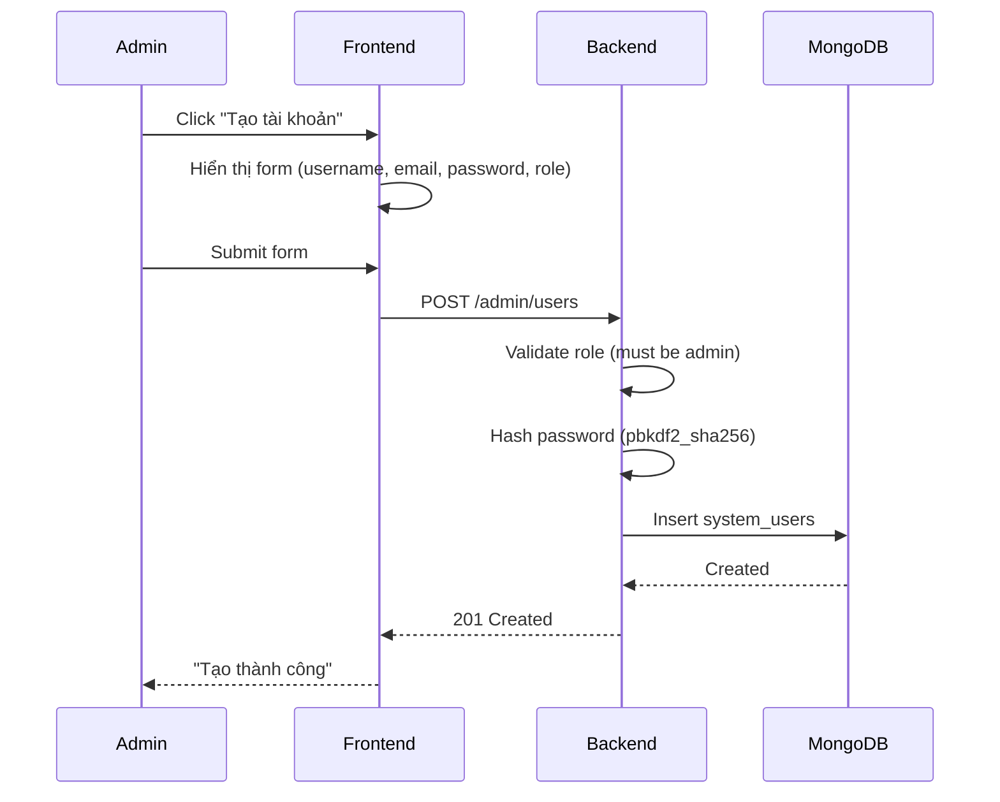

# Admin Panel Use Cases - Navigation Structure

## Overview

Admin Panel được thiết kế với 5 nhóm chức năng chính:

```
Admin Panel
├── Overview
│   └── Dashboard          (UC-015: Metrics, KPIs, Health Status)
│
├── Accounts               (System Users - Admin/Manager accounts)
│   ├── System Users       (UC-023: Tạo/quản lý admin, manager accounts)
│   └── My Profile         (UC-024: Profile của admin đang đăng nhập)
│
├── Students               (Student data management)
│   ├── Student Profiles   (UC-018: Quản lý hồ sơ sinh viên)
│   ├── Conversations      (UC-019: Review chat sessions của sinh viên)
│   └── Activity Log       (UC-025: Lịch sử hoạt động sinh viên)
│
├── Knowledge              (Content management)
│   ├── Knowledge Base     (UC-007/008: Documents & Sources)
│   ├── Datasources        (UC-008: Crawler configs)
│   ├── Vector Store       (UC-011: Qdrant management)
│   ├── Monitor Targets    (UC-008: URL monitoring)
│   └── Approvals          (UC-009: Document approval queue)
│
└── Infra                  (System configuration)
    ├── Model Config       (UC-020: AI/LLM settings)
    └── Settings           (UC-026: System preferences)
```

---

## UC-023: System User Management (Admin Accounts)

### Overview

Quản lý tài khoản có quyền truy cập Admin Panel (Admin và Manager).

**QUAN TRỌNG:** System Users KHÔNG PHẢI là sinh viên. Đây là các tài khoản quản trị hệ thống.

### Roles

| Role | Quyền |
|------|-------|
| **admin** | Toàn quyền: tạo/xóa users, cấu hình hệ thống, xem tất cả data |
| **manager** | Xem & quản lý content, KHÔNG được tạo admin mới, KHÔNG xóa users |

### Data Model

```json
{
  "system_user": {
    "_id": ObjectId,
    "username": "admin_ptit",
    "email": "admin@ptit.edu.vn",
    "password_hash": "pbkdf2:sha256:...",
    "name": "Nguyễn Quản Trị",
    "role": "admin | manager",
    "status": "active | inactive | suspended",
    "last_login": ISODate,
    "created_at": ISODate,
    "created_by": ObjectId,  // Admin who created this account
    "updated_at": ISODate
  }
}
```

### API Endpoints

```
GET    /api/v1/admin/users              # List system users (admin/manager only)
POST   /api/v1/admin/users              # Create new system user (admin only)
GET    /api/v1/admin/users/{id}         # Get user detail
PUT    /api/v1/admin/users/{id}         # Update user
DELETE /api/v1/admin/users/{id}         # Delete user (admin only)
POST   /api/v1/admin/users/{id}/reset-password  # Reset password (admin only)
```

### Workflow



---

## UC-018: Student Profile Management (Sinh viên)

### Overview

Quản lý hồ sơ sinh viên sử dụng hệ thống chat. Khác với System Users, đây là data của người dùng cuối.

### Data Model

```json
{
  "student_profile": {
    "_id": ObjectId,
    "user_id": "student_uuid",
    
    "basic_info": {
      "name": "Nguyễn Văn A",
      "email": "b21dccn123@ptit.edu.vn",
      "student_id": "B21DCCN123",
      "phone": "+84912345678"
    },
    
    "academic_info": {
      "major": "Công nghệ thông tin",
      "class_name": "D21CQCN01-B",
      "level": "junior",  // freshman, sophomore, junior, senior, alumni
      "enrollment_year": 2021
    },
    
    "engagement_metrics": {
      "total_sessions": 89,
      "total_queries": 234,
      "avg_session_duration_min": 12.3,
      "last_active": ISODate,
      "engagement_score": 0.72,  // 0.0 - 1.0
      "active_days_30d": 18
    },
    
    "quality_metrics": {
      "avg_rating": 4.3,
      "feedback_count": 23,
      "positive_feedback_percent": 0.78
    },
    
    "access_control": {
      "status": "active | inactive | suspended | banned",
      "banned_reason": null,
      "banned_at": null,
      "banned_by": null
    },
    
    "created_at": ISODate,
    "updated_at": ISODate
  }
}
```

### API Endpoints

```
GET    /api/v1/admin/students           # List student profiles
GET    /api/v1/admin/students/{id}      # Get student detail
PUT    /api/v1/admin/students/{id}      # Update student status
POST   /api/v1/admin/students/{id}/ban  # Ban student
POST   /api/v1/admin/students/{id}/unban # Unban student
GET    /api/v1/admin/students/export    # Export student list
GET    /api/v1/admin/students/stats     # Aggregated stats
```

### Features

1. **Search & Filter**
   - By name, email, student_id
   - By major, level
   - By engagement score (high/medium/low)
   - By status

2. **Engagement Analytics**
   - Total sessions, queries
   - Avg rating
   - Engagement score calculation

3. **Actions**
   - View full profile
   - View conversations
   - View activity log
   - Ban/Unban student

---

## UC-025: Activity Log

### Overview

Theo dõi lịch sử hoạt động của sinh viên trên hệ thống.

### Data Model

```json
{
  "activity_log": {
    "_id": ObjectId,
    "user_id": "student_uuid",
    "user_name": "Nguyễn Văn A",
    "user_email": "student@ptit.edu.vn",
    
    "action": "Gửi tin nhắn về học phí",
    "action_type": "login | logout | chat | feedback | profile | bookmark | export | error",
    
    "details": "User asked about tuition fees for semester 2",
    "metadata": {
      "session_id": "sess_xxx",
      "message_id": "msg_xxx",
      "query_length": 45
    },
    
    "ip_address": "192.168.1.100",
    "user_agent": "Mozilla/5.0...",
    
    "created_at": ISODate
  }
}
```

### API Endpoints

```
GET    /api/v1/admin/activity-logs      # List activity logs
GET    /api/v1/admin/activity-logs/stats # Daily/weekly stats
```

### Filters

- By user_id
- By action_type
- By date range (today, yesterday, week, month)
- By search query

---

## UC-022: Audit Log (Admin Actions)

### Overview

Khác với Activity Log (sinh viên), Audit Log ghi lại hành động của Admin/Manager.

### Data Model

```json
{
  "audit_log": {
    "_id": ObjectId,
    "actor_id": "admin_uuid",
    "actor_role": "admin | manager",
    "actor_name": "Admin Nguyễn",
    
    "action": "POST /admin/users",
    "target_type": "user | student | document | config",
    "target_id": "user_xxx",
    
    "before_state": { ... },  // Optional: for change tracking
    "after_state": { ... },
    
    "status_code": 200,
    "ip_address": "...",
    "user_agent": "...",
    "request_id": "req_xxx",
    
    "timestamp": ISODate
  }
}
```

### API Endpoints

```
GET    /api/v1/admin/audit-logs         # List audit logs (admin only)
GET    /api/v1/admin/audit-logs/{id}    # Get detail
```

---

## Comparison: System Users vs Students vs Activity vs Audit

| Aspect | System Users (UC-023) | Students (UC-018) | Activity Log (UC-025) | Audit Log (UC-022) |
|--------|----------------------|-------------------|----------------------|-------------------|
| **Who** | Admin, Manager | Sinh viên | Sinh viên | Admin, Manager |
| **Purpose** | Quản lý accounts admin | Quản lý hồ sơ SV | Track SV activity | Track admin actions |
| **Collection** | `system_users` | `student_profiles` | `activity_logs` | `audit_logs` |
| **Create by** | Admin only | Auto from chat | Auto from actions | Auto from middleware |
| **View by** | Admin, Manager | Admin, Manager | Admin, Manager | Admin only |

---

## Navigation Mapping

| Nav Item | Page Component | Use Case |
|----------|---------------|----------|
| Dashboard | DashboardPage | UC-015 |
| System Users | SystemUsersPage | UC-023 |
| My Profile | AdminProfilePage | UC-024 |
| Student Profiles | StudentProfilesPage | UC-018 |
| Conversations | ConversationsPage | UC-019 |
| Activity Log | ActivityLogPage | UC-025 |
| Knowledge | KnowledgePage | UC-007 |
| Datasources | DatasourcesPage | UC-008 |
| Vector Store | VectorStorePage | UC-011 |
| Monitor Targets | MonitorTargetsPage | UC-008 |
| Approvals | PendingApprovalsPage | UC-009 |
| Model | ModelPage | UC-020 |
| Settings | SettingsPage | UC-026 |

---

## Best Practices

### Security

- System Users: Password hashing với pbkdf2_sha256
- API: Kiểm tra role trước khi thực hiện action
- Audit: Log tất cả admin actions

### Separation of Concerns

- **System Users**: Chỉ dành cho accounts có quyền admin
- **Student Profiles**: Data của người dùng cuối (sinh viên)
- **Activity Log**: Track hành vi user
- **Audit Log**: Track hành vi admin (compliance)

### Error Handling

- 401: Chưa đăng nhập
- 403: Không có quyền (manager cố tạo admin)
- 404: User/Student không tồn tại
- 409: Username/Email đã tồn tại
